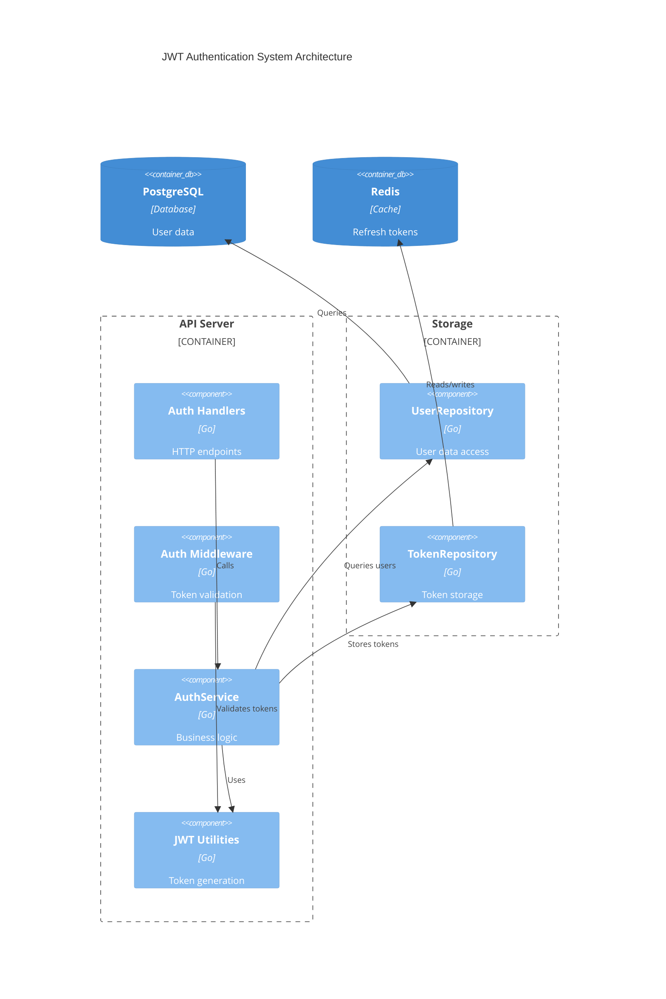
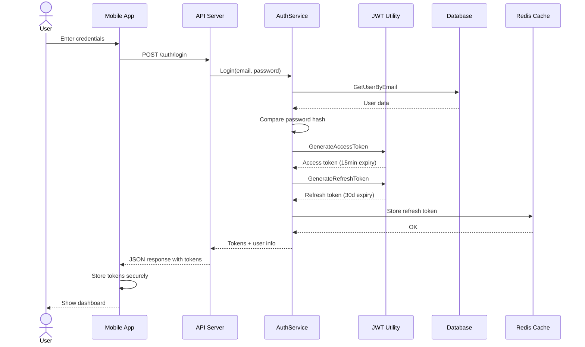

# Feature Delivery Workflow Example

This example demonstrates the complete feature delivery workflow using claude-grimoire's Phase 1 and Phase 2 components.

## Scenario

**Goal:** Add JWT-based authentication system to a Go API

**User:** Product Engineer working on `backend-api` repository

**Starting point:** High-level idea to improve authentication

**Timeline:** From planning to PR in 2-3 weeks

---

## Step 1: Create Initiative with `/initiative-creator`

**User invokes skill:**
```
/initiative-creator
```

### Interview Process

**Skill:** What problem are you trying to solve?

**User:** "Our current session-based auth doesn't work well for mobile apps and makes horizontal scaling harder"

---

**Skill:** Who are the primary stakeholders or users affected?

**User:** "Mobile app developers and our DevOps team trying to scale the API"

---

**Skill:** Is this related to any existing initiatives or issues?

**User:** "Yes, relates to #145 (Mobile app development) and #200 (API scaling project)"

---

**Skill:** What repositories will be involved?

**User:** "Just the backend-api repository for now. Mobile app will integrate after"

---

**Skill:** What are the primary goals of this initiative?

**User:** "1. Replace session cookies with JWT tokens 2. Support mobile authentication 3. Enable stateless horizontal scaling"

---

**Skill:** How will you measure success?

**User:** "1. Mobile app can authenticate successfully 2. API can scale horizontally without session affinity 3. Zero security vulnerabilities in implementation"

---

**Skill:** What's explicitly in scope for this initiative?

**User:** "JWT generation and validation, login/logout/refresh endpoints, token storage in Redis"

---

**Skill:** What's explicitly out of scope?

**User:** "OAuth integration, password reset, account management. Those are separate initiatives"

---

**Skill:** Are there any technical constraints?

**User:** "Must maintain backwards compatibility with existing web app using session auth during migration. Need zero downtime deployment"

---

**Skill:** Does this depend on any other work being completed first?

**User:** "No hard dependencies. Would be nice to have Redis cluster setup (#180) but not blocking"

---

**Skill:** What's the target completion date?

**User:** "3 weeks from now. We have mobile app team waiting on this"

---

**Skill:** Can this be broken into phases?

**User:** "Yes - Phase 1: Core JWT implementation Phase 2: Migrate web app Phase 3: Enable for mobile"

---

**Skill:** This initiative involves authentication architecture and API design. Would you like me to create a visual PRD with architecture diagrams and API mockups?

**Options:**
- A) Yes, create comprehensive visual PRD
- B) Just architecture diagrams, no UI mockups
- C) Skip visual PRD, proceed with text description

**User:** "A - Let's do the full visual PRD"

---

### Invoking Visual PRD

**Skill invokes:** `/visual-prd` with gathered context

*(See Visual PRD section below for details)*

---

### Generated Initiative

**Skill creates GitHub issue #250:**

```markdown
# Add JWT-based Authentication System

## Overview
Replace session-based authentication with JWT tokens to enable mobile app authentication and stateless horizontal scaling of the API.

## Problem Statement
Current session-based auth uses server-side session storage which:
- Doesn't work with mobile apps (no cookie support)
- Requires session affinity for horizontal scaling
- Creates scaling bottleneck as user base grows

## Goals
1. Replace session cookies with JWT tokens
2. Enable mobile app authentication
3. Support stateless horizontal scaling

## Success Metrics
- Mobile app authentication success rate: 100%
- API horizontal scaling: No session affinity required
- Security: Zero critical vulnerabilities in security review
- Performance: Token validation <5ms (p95)

## Scope

### In Scope
- JWT generation and validation utilities
- Login, logout, and token refresh endpoints
- Token storage in Redis (refresh tokens)
- Backwards compatibility with existing session auth
- Security review and testing

### Out of Scope
- OAuth/SSO integration (separate initiative #260)
- Password reset flow (existing, not changing)
- Account management endpoints (existing)

## Technical Approach
JWT-based authentication using RS256 signing:
- Access tokens: Short-lived (15min), stateless validation
- Refresh tokens: Long-lived (30 days), stored in Redis
- Dual-auth support: JWT and sessions during migration

**Visual PRD:** [docs/prds/2026-04-13-jwt-authentication.html](../prds/2026-04-13-jwt-authentication.html)

## Dependencies
- Nice to have: #180 (Redis cluster) - Not blocking, can use single Redis
- Related: #145 (Mobile app) - Mobile team waiting on this
- Related: #200 (API scaling) - This unblocks horizontal scaling

## Constraints
- **Zero downtime deployment:** Must maintain backwards compatibility
- **Security:** Follow OWASP best practices, security review required
- **Performance:** Token validation must be fast (<5ms p95)
- **Migration:** Web app continues using sessions until Phase 2

## Timeline
- **Target Start:** April 14, 2026
- **Target Completion:** May 5, 2026 (3 weeks)

### Milestones
- [ ] Phase 1: Core JWT implementation (Week 1)
- [ ] Phase 2: Testing and security review (Week 2)
- [ ] Phase 3: Production deployment with feature flag (Week 3)

## Repositories Affected
- `backend-api` - Add JWT utilities, auth endpoints, middleware

## Stakeholders
- **Owner:** @productEngineer
- **Contributors:** @backendDev1, @backendDev2
- **Reviewers:** @techLead, @securityEngineer

## Related Work
- Related to #145 (Mobile app development)
- Related to #200 (API scaling project)
- Unblocks #270 (Mobile authentication)

## Risk Assessment
- **Breaking existing auth during migration**: Test dual-auth thoroughly, feature flag rollout
- **Security vulnerabilities**: Third-party security review, penetration testing
- **Performance regression**: Load testing, profiling, caching strategy

## Questions and Unknowns
- Should we use RS256 or HS256 for signing? (Leaning RS256 for key rotation)
- Redis cluster timing - proceed with single instance?
- Security review SLA - how long for turnaround?

---
Created with 🤖 [claude-grimoire](https://github.com/martythewizard/claude-grimoire)
```

**Labels applied:** `initiative`, `planning`, `enhancement`, `security`

**Milestone set:** Q2 2026

---

## Step 2: Visual PRD Creation

**Invoked by initiative-creator**, the visual-prd skill creates comprehensive documentation:

### Architecture Diagrams Generated

**Component Diagram (C4):**


**Sequence Diagram (Login Flow):**


### Technical Decisions Documented

**Decision 1: RS256 vs HS256**
- **Chosen:** RS256 (public/private key)
- **Rationale:** Enables key rotation without service restart, public key can be shared for token verification
- **Trade-offs:** Slightly slower than HS256 but better security model
- **Alternatives:** HS256 (simpler but shared secret), ES256 (smaller tokens but less support)

**Decision 2: Refresh Token Storage**
- **Chosen:** Redis with TTL
- **Rationale:** Fast access, automatic expiry, scales horizontally
- **Trade-offs:** Redis is another dependency vs database is simpler but slower
- **Alternatives:** Database (slower), in-memory (lost on restart)

### API Design Documented

```
POST /auth/login
  Body: { "email": "user@example.com", "password": "secret123" }
  Response: {
    "accessToken": "eyJ...",
    "refreshToken": "abc...",
    "expiresIn": 900,
    "user": { "id": "...", "email": "...", "name": "..." }
  }

POST /auth/refresh
  Body: { "refreshToken": "abc..." }
  Response: {
    "accessToken": "eyJ...",
    "refreshToken": "def...",
    "expiresIn": 900
  }

POST /auth/logout
  Body: { "refreshToken": "abc..." }
  Response: { "success": true }

GET /auth/me (requires valid access token)
  Response: { "id": "...", "email": "...", "name": "..." }
```

### Security Considerations Documented

- Password hashing: bcrypt with cost factor 12
- Token signing: RS256 with 2048-bit keys
- Token expiry: Access 15min, Refresh 30 days
- Rate limiting: 5 login attempts per minute per IP
- HTTPS only for all auth endpoints
- HttpOnly, Secure, SameSite cookies for web clients

**PRD saved to:** `docs/prds/2026-04-13-jwt-authentication.html`

---

## Step 3: Break Down Initiative with `/initiative-breakdown`

**User invokes skill:**
```
/initiative-breakdown owner/backend-api#250
```

### Agent Invocation

**Skill invokes:** `github-context-agent` to fetch initiative #250 details

**Agent returns:**
- Initiative title, description, goals
- Success metrics and acceptance criteria
- Related issues (#145, #200)
- Constraints (zero downtime, backwards compatibility)
- Technical approach from visual PRD

### Complexity Assessment

**Skill analyzes:**
- New abstraction layers needed (JWT utilities, auth service)
- Database migration required (No - reusing users table)
- Multiple repositories? (No - just backend-api)
- External integrations? (Just Redis, already in use)

**Skill assesses:** Medium complexity - architecture already designed in visual PRD

**Skill asks:** "Architecture is already designed in the visual PRD. Should I proceed with task breakdown?"

**User:** "Yes, let's break it down"

### Generated Task Breakdown

**Foundation Tasks (Week 1)**

**#251: [Foundation] Create JWT generation and validation utilities**
```markdown
**Description:**
Implement JWT utility package with RS256 signing, token generation, and validation logic.

**Acceptance Criteria:**
- [ ] GenerateAccessToken() creates valid JWT with 15min expiry
- [ ] GenerateRefreshToken() creates random secure token
- [ ] ValidateAccessToken() verifies signature and expiry
- [ ] RS256 public/private key pair loaded from config
- [ ] Unit tests with >90% coverage
- [ ] Error handling for invalid/expired tokens

**Implementation Notes:**
- Create new package: `pkg/jwt/jwt.go`
- Use `github.com/golang-jwt/jwt` library
- Follow existing error handling pattern from `pkg/errors`
- Store keys in `config/keys/` directory (gitignored)
- Add config loading in `pkg/config/config.go`

**Files to Modify:**
- `pkg/jwt/jwt.go` (new) - JWT utility functions
- `pkg/jwt/jwt_test.go` (new) - Unit tests
- `pkg/config/config.go` - Add JWT config section
- `config/config.example.yaml` - Add JWT config example

**Dependencies:** None

**Effort Estimate:** M (3-4 days)
**Priority:** Critical
```

---

**#252: [Foundation] Add token repository for refresh token storage**
```markdown
**Description:**
Create repository interface and Redis implementation for storing/retrieving refresh tokens.

**Acceptance Criteria:**
- [ ] TokenRepository interface defined
- [ ] Redis implementation with TTL support
- [ ] StoreRefreshToken() saves token with 30-day TTL
- [ ] GetRefreshToken() retrieves token if valid
- [ ] RevokeRefreshToken() deletes token
- [ ] Unit tests with mock Redis client
- [ ] Integration tests with real Redis (testcontainers)

**Implementation Notes:**
- Follow existing repository pattern from `internal/repository/user_repository.go`
- Use existing Redis client from `pkg/cache/redis.go`
- Key format: `refresh_token:{token_id}`
- Store user_id as value for quick lookup

**Files to Modify:**
- `internal/repository/token_repository.go` (new) - Interface and impl
- `internal/repository/token_repository_test.go` (new) - Tests
- `pkg/cache/redis.go` - Add helper methods if needed

**Dependencies:** None (uses existing Redis setup)

**Effort Estimate:** S (2 days)
**Priority:** Critical
```

---

**Implementation Tasks (Week 1-2)**

**#253: [Implementation] Create AuthService with login/logout/refresh logic**
```markdown
**Description:**
Implement authentication service with business logic for login, logout, and token refresh.

**Acceptance Criteria:**
- [ ] Login() authenticates user and returns tokens
- [ ] Logout() revokes refresh token
- [ ] RefreshToken() exchanges refresh for new access token
- [ ] Password comparison uses constant-time comparison
- [ ] Failed login attempts logged for monitoring
- [ ] Unit tests for all methods
- [ ] Mock repositories for testing

**Implementation Notes:**
- Follow service pattern from `internal/service/user_service.go`
- Use UserRepository for user lookup
- Use TokenRepository for refresh token storage
- Use JWT utilities for token generation
- Log failed attempts to `pkg/logger`

**Files to Modify:**
- `internal/service/auth_service.go` (new) - Service implementation
- `internal/service/auth_service_test.go` (new) - Unit tests
- `internal/service/service.go` - Register AuthService

**Dependencies:**
- Depends on: #251 (JWT utilities)
- Depends on: #252 (Token repository)

**Effort Estimate:** M (3 days)
**Priority:** High
```

---

**#254: [Implementation] Add auth HTTP handlers (login, logout, refresh)**
```markdown
**Description:**
Create HTTP handlers for authentication endpoints following API design from visual PRD.

**Acceptance Criteria:**
- [ ] POST /auth/login handler implemented
- [ ] POST /auth/logout handler implemented
- [ ] POST /auth/refresh handler implemented
- [ ] Request validation with proper error responses
- [ ] Rate limiting applied (5 req/min per IP)
- [ ] HTTP status codes match API spec
- [ ] Integration tests for all endpoints

**Implementation Notes:**
- Follow handler pattern from `internal/handler/user_handler.go`
- Use existing validation middleware
- Use existing rate limit middleware
- Return standardized JSON responses
- Add to router in `internal/router/router.go`

**Files to Modify:**
- `internal/handler/auth_handler.go` (new) - HTTP handlers
- `internal/handler/auth_handler_test.go` (new) - Integration tests
- `internal/router/router.go` - Register auth routes
- `internal/middleware/rate_limit.go` - Add auth rate limits if needed

**Dependencies:**
- Depends on: #253 (AuthService)

**Effort Estimate:** M (3 days)
**Priority:** High
```

---

**#255: [Implementation] Add auth middleware for token validation**
```markdown
**Description:**
Create middleware to validate JWT tokens on protected endpoints and inject user context.

**Acceptance Criteria:**
- [ ] Middleware extracts token from Authorization header
- [ ] Validates token signature and expiry
- [ ] Injects user claims into request context
- [ ] Returns 401 for invalid/missing tokens
- [ ] Works with existing protected routes
- [ ] Unit tests for all validation paths

**Implementation Notes:**
- Follow middleware pattern from `internal/middleware/auth_middleware.go` (existing session auth)
- Extract token from "Bearer {token}" header
- Use JWT utilities to validate
- Store user claims in context with `context.WithValue`
- Existing code can retrieve user from context

**Files to Modify:**
- `internal/middleware/jwt_auth_middleware.go` (new) - JWT validation
- `internal/middleware/jwt_auth_middleware_test.go` (new) - Tests
- `internal/router/router.go` - Add middleware to protected routes (feature flagged)

**Dependencies:**
- Depends on: #251 (JWT utilities)

**Effort Estimate:** S (2 days)
**Priority:** High
```

---

**Testing Tasks (Week 2)**

**#256: [Testing] Add integration tests for full auth flow**
```markdown
**Description:**
Create end-to-end integration tests covering login, token refresh, and logout flows.

**Acceptance Criteria:**
- [ ] Test: Successful login returns valid tokens
- [ ] Test: Invalid credentials return 401
- [ ] Test: Expired access token requires refresh
- [ ] Test: Refresh token exchange succeeds
- [ ] Test: Logout invalidates refresh token
- [ ] Test: Rate limiting blocks excessive login attempts
- [ ] Tests use real Redis (testcontainers)
- [ ] Tests run in CI pipeline

**Implementation Notes:**
- Follow test pattern from `test/integration/user_test.go`
- Use `testcontainers` for Redis
- Create test fixtures for users
- Test both success and failure paths
- Include edge cases (expired tokens, invalid tokens)

**Files to Modify:**
- `test/integration/auth_test.go` (new) - Integration tests
- `test/fixtures/users.go` - Add test users if needed

**Dependencies:**
- Depends on: #254 (Auth handlers)
- Depends on: #255 (Auth middleware)

**Effort Estimate:** M (3 days)
**Priority:** High
```

---

**#257: [Testing] Security review and penetration testing**
```markdown
**Description:**
Security review of JWT implementation and penetration testing for auth vulnerabilities.

**Acceptance Criteria:**
- [ ] Static analysis (gosec) passes with no high/critical issues
- [ ] Manual code review by security engineer
- [ ] Penetration testing for common vulnerabilities:
  - [ ] Token forgery attempts
  - [ ] Token replay attacks
  - [ ] Timing attacks on password comparison
  - [ ] Rate limit bypass attempts
  - [ ] XSS/CSRF vulnerabilities
- [ ] All findings documented and remediated
- [ ] Security sign-off obtained

**Implementation Notes:**
- Schedule with @securityEngineer
- Use OWASP testing guide
- Document findings in `docs/security/jwt-auth-review.md`
- Fix any issues before production deployment

**Files to Modify:**
- `docs/security/jwt-auth-review.md` (new) - Security review report
- Any code files requiring fixes based on findings

**Dependencies:**
- Depends on: #256 (Integration tests passing)

**Effort Estimate:** L (5 days - includes security engineer time)
**Priority:** Critical
```

---

**Documentation & Deployment (Week 3)**

**#258: [Documentation] Update API documentation with auth endpoints**
```markdown
**Description:**
Add JWT authentication documentation to API docs including examples and error codes.

**Acceptance Criteria:**
- [ ] OpenAPI spec updated with auth endpoints
- [ ] Authentication section in README
- [ ] Example requests with curl commands
- [ ] Error codes documented
- [ ] Migration guide for web app developers

**Implementation Notes:**
- Update `docs/api/openapi.yaml`
- Add examples to `docs/api/authentication.md`
- Include token refresh flow diagram
- Document backwards compatibility plan

**Files to Modify:**
- `docs/api/openapi.yaml` - Add auth endpoint specs
- `docs/api/authentication.md` (new) - Auth guide
- `README.md` - Update auth section

**Dependencies:**
- Can start anytime (documentation)

**Effort Estimate:** S (1 day)
**Priority:** Medium
```

---

**#259: [Deployment] Add feature flag and deploy to production**
```markdown
**Description:**
Deploy JWT authentication to production behind feature flag for gradual rollout.

**Acceptance Criteria:**
- [ ] Feature flag `jwt_auth_enabled` added to config
- [ ] Defaults to false (session auth remains default)
- [ ] Can be enabled per-user or per-tenant
- [ ] Monitoring dashboards updated
- [ ] Alerts configured for auth failures
- [ ] Rollback plan documented and tested
- [ ] Production deployment successful

**Implementation Notes:**
- Use existing feature flag system
- Add metrics to `pkg/metrics/auth_metrics.go`
- Create Grafana dashboard for auth metrics
- Configure alerts in `config/alerts/`
- Test rollback in staging first

**Files to Modify:**
- `pkg/config/feature_flags.go` - Add JWT flag
- `pkg/metrics/auth_metrics.go` (new) - Auth metrics
- `config/grafana/auth_dashboard.json` (new) - Dashboard
- `config/alerts/auth_alerts.yaml` (new) - Alerts
- `docs/deployment/rollout-plan.md` (new) - Deployment plan

**Dependencies:**
- Depends on: #257 (Security review passed)
- Depends on: #258 (Documentation complete)

**Effort Estimate:** M (3 days)
**Priority:** High
```

---

### Summary Comment on Initiative #250

**Skill adds comment to initiative:**

```markdown
## 📋 Task Breakdown

This initiative has been broken down into **9 tasks**:

### Foundation (Est: 5-6 days)
- [ ] #251 - Create JWT utilities (M) - **Critical path**
- [ ] #252 - Add token repository (S)

### Implementation (Est: 8 days)
- [ ] #253 - Create AuthService (M) - Depends on #251, #252
- [ ] #254 - Add HTTP handlers (M) - Depends on #253
- [ ] #255 - Add auth middleware (S) - Depends on #251

### Testing (Est: 8 days)
- [ ] #256 - Integration tests (M) - Depends on #254, #255
- [ ] #257 - Security review (L) - **Critical** - Depends on #256

### Documentation & Deployment (Est: 4 days)
- [ ] #258 - API documentation (S) - Can start anytime
- [ ] #259 - Production deployment (M) - Depends on #257, #258

**Total Estimated Effort:** 25-27 days (individual tasks) = ~3 weeks (with parallelization)

**Critical Path:** #251 → #253 → #254 → #256 → #257 → #259 (17 days)

**Tasks that can be parallelized:**
- #251 and #252 can start immediately
- #254 and #255 can proceed in parallel after #253
- #258 can start anytime

**Architecture Design:** [Visual PRD](../../prds/2026-04-13-jwt-authentication.html)

**Next Steps:**
1. Assign tasks to team members
2. Start with #251 and #252 (foundation tasks)
3. Use `feature-delivery-team` for each task implementation

---
Generated with 🤖 [claude-grimoire](https://github.com/martythewizard/claude-grimoire)
```

**User response:** "Perfect breakdown! Let's start with #251"

---

## Step 4: Implement Task #251 with Feature-Delivery-Team

**User invokes team:** (This would be a future Phase 4 component)
```
feature-delivery-team --task=251
```

For now, user works on the task and when ready to create PR, uses:

---

## Step 5: Create PR with `/pr-author`

**After implementing JWT utilities, user invokes:**
```
/pr-author
```

### Skill Workflow

1. **Analyze git state:**
   ```bash
   git status
   git diff main
   git log main..HEAD
   ```

2. **Fetch GitHub context via github-context-agent:**
   ```
   github-context-agent({
     "type": "issue",
     "identifier": "owner/backend-api#251",
     "depth": "standard"
   })
   ```

3. **Agent returns task details:**
   - Acceptance criteria
   - Implementation notes
   - Files that should be modified
   - Related initiative #250

4. **Skill asks clarifying questions:**
   > "Are there any notable implementation decisions or trade-offs to mention in the PR?"
   
   **User:** "Chose jwt-go library over jose library for better community support"

5. **Generate PR description:**

```markdown
## Summary
Implement JWT utilities for access token generation and validation using RS256 signing. This provides the foundation for JWT-based authentication.

## Related Issues
Part of #250 (JWT Authentication System)
Closes #251

## Changes

### Added
- `pkg/jwt/jwt.go` - JWT generation and validation utilities
  - GenerateAccessToken() creates RS256-signed JWTs with 15min expiry
  - GenerateRefreshToken() creates cryptographically secure random tokens
  - ValidateAccessToken() verifies signature, expiry, and claims
  - Key loading from PEM files

- `pkg/jwt/jwt_test.go` - Comprehensive unit tests (95% coverage)
  - Token generation and validation
  - Expiry handling
  - Invalid signature detection
  - Malformed token handling

- `pkg/config/config.go` - JWT configuration section
  - Public/private key paths
  - Token expiry durations
  - Issuer and audience claims

- `config/config.example.yaml` - Example JWT configuration

### Dependencies
- Added `github.com/golang-jwt/jwt v5.2.0` for JWT operations

## Implementation Notes

**Library choice:** Used `jwt-go` over `jose` for better community support and simpler API for our use case.

**Key management:** RS256 keys loaded from PEM files in `config/keys/` directory (gitignored). Keys should be generated per environment and stored securely.

**Security considerations:**
- RS256 (not HS256) for public key verification
- Constant-time operations where possible
- Comprehensive error handling for invalid tokens

## Test Plan
- [x] Unit tests pass (95% coverage)
- [x] Token generation creates valid JWTs
- [x] Token validation rejects expired tokens
- [x] Token validation rejects invalid signatures
- [x] Token validation rejects malformed tokens
- [x] Key loading handles missing files gracefully
- [x] Config loading validates required fields

## Migration Notes
None - this is new functionality with no existing dependencies.

---
🤖 Generated with [claude-grimoire](https://github.com/martythewizard/claude-grimoire)
```

6. **Create PR:**
   ```bash
   gh pr create \
     --title "Add JWT generation and validation utilities" \
     --body "[PR description above]" \
     --label "enhancement" \
     --label "security" \
     --assignee @me
   ```

7. **Report success:**
   > ✅ **PR created successfully!**
   >
   > **URL:** https://github.com/owner/backend-api/pull/345
   > **Title:** Add JWT generation and validation utilities
   > **Related:** Part of initiative #250, Closes #251
   >
   > The PR includes comprehensive test coverage and follows the implementation plan from the task breakdown.

---

## Outcome

**Timeline achieved:**
- **Week 1:** Initiative created, visual PRD generated, tasks broken down, first 2 tasks completed
- **Week 2:** Implementation tasks completed, integration tests written, security review scheduled
- **Week 3:** Security review passed, documentation updated, deployed to production with feature flag

**Efficiency gains:**
- **Initiative creation:** 30 minutes (vs 2 hours manual)
- **Visual PRD:** 45 minutes (vs 4 hours manual)
- **Task breakdown:** 20 minutes (vs 1.5 hours manual)
- **PR descriptions:** 3 minutes each (vs 10-15 minutes each)

**Total time saved:** ~8-10 hours of planning work, allowing engineer to focus on implementation

**Quality improvements:**
- Consistent documentation format
- All PRs properly reference tasks and initiative
- Architecture decisions captured upfront
- Security considerations documented early

**Team collaboration:**
- Visual PRD shared with mobile team for early feedback
- Task breakdown enabled parallel work by multiple engineers
- PR descriptions provided clear context for reviewers