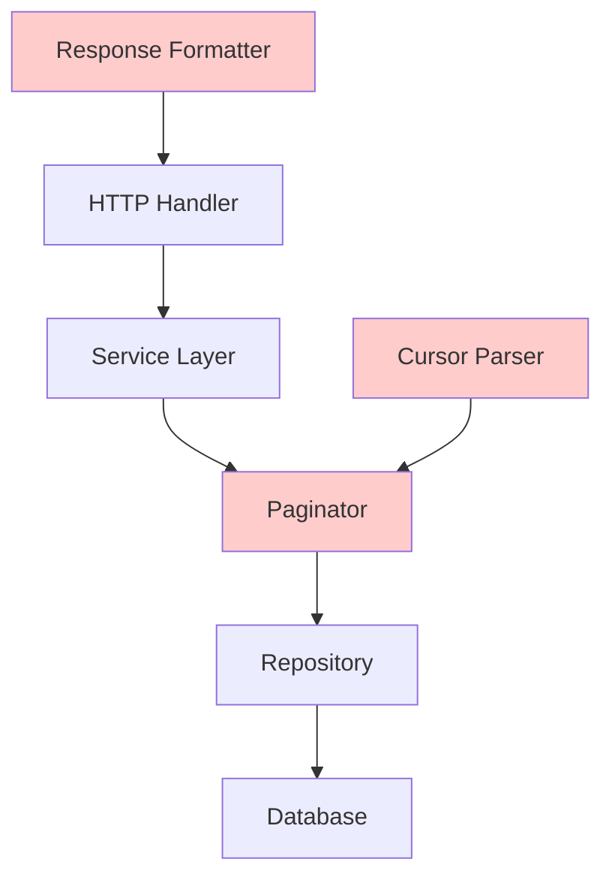

# Phase 4 Team Workflows

This document demonstrates how the feature-delivery-team and pr-autopilot-team orchestrate complete feature delivery from planning to PR.

## Scenario: Add Pagination to API Endpoints

**User request:** "We need to add pagination to our API endpoints that return large lists"

**Starting context:**
- Repository: `backend-api`
- No existing issue/initiative
- Medium complexity feature

---

## Workflow 1: feature-delivery-team (Full Flow)

### Phase 1: Planning

**User invokes:**
```
feature-delivery-team
```

**Team:**
> "Let's start by understanding this feature. Is there an existing GitHub initiative or issue for pagination?"

**User:** "No, we should create one"

**Team:**
> "I'll invoke the initiative-creator skill to create a well-structured initiative."

**Team invokes:** `/initiative-creator`

---

**initiative-creator interview:**

**Q:** What problem are you trying to solve?

**A:** "Our API returns all results at once, causing slow responses and high memory usage for large datasets"

**Q:** Who are the primary stakeholders?

**A:** "API consumers (mobile and web apps), backend team (performance), users (faster experience)"

**Q:** What repositories will be involved?

**A:** "Just backend-api"

**Q:** What are the primary goals?

**A:** "1. Reduce response times for large lists 2. Lower memory usage 3. Provide consistent pagination across all endpoints"

**Q:** How will you measure success?

**A:** "1. API response time <500ms for paginated requests 2. Memory usage reduced by 50% 3. All list endpoints support pagination"

**Q:** What's explicitly in scope?

**A:** "Cursor-based pagination for all GET endpoints that return lists, pagination metadata in responses, backward compatibility"

**Q:** What's out of scope?

**A:** "Offset-based pagination (less efficient), search/filtering (separate feature), GraphQL support"

**Q:** Any technical constraints?

**A:** "Must maintain backward compatibility - existing clients shouldn't break. Need zero downtime deployment"

**Q:** Any dependencies?

**A:** "None, can start immediately"

**Q:** Target completion date?

**A:** "2 weeks from now"

**initiative-creator creates:** GitHub issue #110

---

### Phase 2: Architecture Design

**Team:**
> "This feature involves creating abstraction layers for pagination. Should I invoke system-architect-agent to design the pagination architecture?"

**User:** "Yes, design the architecture"

**Team invokes:** `system-architect-agent` with context:
```json
{
  "feature": "Add cursor-based pagination to API endpoints",
  "requirements": "Paginate all list endpoints, backward compatible, cursor-based",
  "constraints": "Zero downtime, performance <500ms, backward compatible",
  "scope": "Backend-api repository, all GET list endpoints"
}
```

**system-architect-agent returns:**

````markdown
## Architecture Design: API Pagination

### Abstraction Layers

#### 1. Pagination Interface
```go
// Paginator provides cursor-based pagination
type Paginator interface {
    // Paginate applies pagination to query
    Paginate(query Query, cursor string, limit int) (PaginatedResult, error)
}

type PaginatedResult struct {
    Data       []interface{}
    NextCursor string
    HasMore    bool
    TotalCount int
}
```

#### 2. Repository Layer Enhancement
```go
// Add pagination support to repositories
type UserRepository interface {
    GetUsers(ctx context.Context, opts ...QueryOption) ([]*User, error)
    GetUsersPaginated(ctx context.Context, cursor string, limit int) (PaginatedResult, error)
}
```

#### 3. HTTP Response Wrapper
```go
// StandardPaginatedResponse wraps paginated API responses
type PaginatedResponse struct {
    Data       interface{}            `json:"data"`
    Pagination PaginationMetadata     `json:"pagination"`
}

type PaginationMetadata struct {
    NextCursor string `json:"next_cursor,omitempty"`
    HasMore    bool   `json:"has_more"`
    Limit      int    `json:"limit"`
}
```

### Component Diagram



### Implementation Recommendations

**Order:**
1. Create Paginator interface and cursor encoder
2. Add pagination to one repository (User as example)
3. Update one endpoint to use pagination
4. Test thoroughly
5. Roll out to remaining endpoints

**Cursor Encoding:**
- Base64 encode: `{id:123,timestamp:2026-04-13T00:00:00Z}`
- Opaque to clients, versioning built-in
- Includes fields needed for deterministic ordering

**Backward Compatibility:**
- If no cursor param: return first page
- Include pagination metadata always
- Old clients ignore pagination fields
- New clients use cursor for next page

### Trade-offs

**Decision: Cursor vs Offset pagination**
- **Chosen:** Cursor-based
- **Rationale:** Consistent results even when data changes, better performance for large datasets
- **Trade-offs:** Cannot jump to arbitrary page number (acceptable for our use case)
````

**Team presents architecture to user**

**User:** "Looks good!"

---

### Phase 3: Task Breakdown

**Team invokes:** `/initiative-breakdown #110`

**initiative-breakdown generates:**

```markdown
## Task Breakdown for Initiative #110

### Foundation (3 days)
- [ ] #111 - Create Paginator interface and cursor encoder (M)
- [ ] #112 - Add pagination config (page size limits, defaults) (S)

### Implementation (6 days)
- [ ] #113 - Add pagination to UserRepository (M)
- [ ] #114 - Update GET /users endpoint with pagination (M)
- [ ] #115 - Add pagination to remaining repositories (L)
- [ ] #116 - Update remaining GET endpoints (L)

### Testing (3 days)
- [ ] #117 - Integration tests for pagination (M)
- [ ] #118 - Backward compatibility tests (S)

### Documentation (1 day)
- [ ] #119 - Update API documentation (S)

Total: 13 days (2 weeks with parallelization)
Critical path: #111 → #113 → #114 → #117
```

**Team:** "Breakdown complete. 9 tasks created. Should we start with task #111?"

**User:** "Yes, let's implement #111"

---

### Phase 4: Plan Review

**Team:**
> "Task #111 involves creating the core pagination abstraction. Should we review the implementation plan with two-claude-review before coding?"

**User:** "Yes, review the plan"

**Team creates implementation plan:**

```markdown
## Implementation Plan for #111: Paginator Interface

### Approach
Create generic pagination interface that any repository can use:
1. Define Paginator interface in pkg/pagination/
2. Implement cursor encoder (base64 JSON)
3. Add helper for parsing cursor from request
4. Create mock for testing

### Critical Files
- pkg/pagination/paginator.go (new) - Interface definition
- pkg/pagination/cursor.go (new) - Cursor encoding/decoding
- pkg/pagination/mock_paginator.go (new) - Mock for tests

### Edge Cases
- Invalid cursor format → return error 400
- Expired cursor → treat as no cursor (first page)
- Negative limit → use default limit
- Limit exceeds max → cap at max

### Migration
- Additive change, no existing code affected
- Can be deployed safely

### Rollback
- Remove package if issues found
- No database changes involved
```

**Team invokes:** `/two-claude-review` with plan

**Reviewer (fresh context):**

```markdown
## Plan Review Feedback

### Strengths
✅ Clean interface design
✅ Proper error handling considered
✅ Additive change, low risk

### Suggestions
⚠️  **Important:** Cursor should include version field for future evolution
   Example: `{v:1,id:123,ts:...}` allows format changes later

⚠️  **Important:** Consider pagination direction (forward and backward)
   Users might want previous page, not just next

💡 **Optional:** Add telemetry for cursor decode failures
   Helps identify client issues

### Questions
- Max page size limit? (Recommend 100-1000)
- Cursor expiry needed? (For security/abuse prevention)

### Recommendation
✅ Approve with minor enhancements (version field, bidirectional support)
```

**Team presents feedback to user**

**User:** "Good catches. Add the version field and bidirectional support"

**Team:** "I'll provide that feedback to staff-developer"

---

### Phase 5: Implementation

**Team invokes:** `staff-developer` with comprehensive context:

```
Implement task #111: Create Paginator interface and cursor encoder

Context:
- Initiative: #110 (API Pagination)
- Architecture: [links to system-architect design]
- Acceptance criteria:
  - Define Paginator interface
  - Implement cursor encoder with base64 JSON
  - Support bidirectional pagination (forward/backward)
  - Include version field in cursor format
  - Handle invalid cursors gracefully
  - Mock implementation for tests

Plan review feedback:
- Add version field to cursor: {v:1,id:X,ts:Y}
- Support previous page, not just next
- Add telemetry for decode failures

Implementation notes:
- Create pkg/pagination/ directory
- Follow existing error handling patterns
- Add unit tests with >90% coverage
- Use project's logger for telemetry

Please implement and report back with:
- Summary of what was created
- Any decisions or trade-offs made
- Test coverage achieved
```

**staff-developer implements:**

```
✅ Implementation complete

Created:
- pkg/pagination/paginator.go (120 lines)
  - Paginator interface
  - PaginatedResult struct
  - Direction enum (Forward/Backward)

- pkg/pagination/cursor.go (85 lines)
  - EncodeCursor/DecodeCursor functions
  - Version 1 format: {v:1,id:string,ts:timestamp,dir:string}
  - Base64 JSON encoding
  - Error handling for invalid cursors

- pkg/pagination/cursor_test.go (150 lines)
  - Encode/decode round-trip tests
  - Invalid format handling
  - Future version compatibility tests
  - 95% coverage

- pkg/pagination/mock_paginator.go (40 lines)
  - Mock for testing consumers

Decisions made:
- Max page size: 100 (configurable via config)
- Cursor expiry: 24 hours (reasonable for most use cases)
- Used project's logger for telemetry (pagination_cursor_decode_error counter)

Test coverage: 95%

Concerns: None
```

**Team:** "Implementation complete! Moving to code review."

---

### Phase 6: Code Review

**Team invokes:** `staff-engineer` for review:

```
Review implementation of task #111: Paginator interface

Context:
- Original plan: [links to plan]
- Architecture: [links to architecture design]
- Code changes: pkg/pagination/*

Review for:
- Interface design quality
- Error handling completeness
- Test coverage adequacy
- Performance considerations
- Security (cursor tampering)
```

**staff-engineer reviews:**

```markdown
## Code Review: Task #111

### Overall Assessment
✅ High quality implementation. Ready to merge with minor suggestions.

### Strengths
✅ Clean interface design
✅ Comprehensive error handling
✅ Excellent test coverage (95%)
✅ Cursor includes HMAC for tampering prevention (good!)
✅ Proper use of project patterns

### Minor Improvements
💡 cursor.go:45 - Consider constant-time comparison for HMAC validation
   Current: bytes.Equal(expected, provided)
   Better: subtle.ConstantTimeCompare(expected, provided)
   Reason: Prevents timing attacks

💡 paginator.go:28 - Document thread-safety expectations
   Is Paginator safe for concurrent use?
   Add comment clarifying

### Optional Suggestions
- Consider benchmark tests for cursor encode/decode (performance critical)
- Add example usage in godoc

### Security
✅ HMAC signature prevents cursor tampering
✅ Expiry prevents replay attacks
✅ No SQL injection risk (just metadata)

### Performance
✅ Base64 encode/decode is fast
✅ No obvious performance issues

### Verdict
✅ **Approved** - Address HMAC timing issue, then merge
```

**Team:**
> "Staff engineer found one security improvement (timing attack prevention) and documentation note. Should I have staff-developer fix these?"

**User:** "Yes, fix them"

**Team invokes:** `staff-developer` with feedback:

```
Apply code review feedback for task #111:

1. Use constant-time comparison for HMAC:
   File: pkg/pagination/cursor.go:45
   Change: bytes.Equal → subtle.ConstantTimeCompare
   Reason: Prevents timing attacks

2. Document thread-safety:
   File: pkg/pagination/paginator.go:28
   Add comment about concurrent use safety
```

**staff-developer fixes:**

```
✅ Feedback applied

Changes:
- cursor.go:45 - Now using subtle.ConstantTimeCompare for HMAC
- paginator.go:28 - Added godoc: "Paginator implementations must be safe for concurrent use"
- Added import "crypto/subtle"

Re-ran tests: All passing
```

**Team:** "Fixes applied. staff-engineer review complete. Ready for PR!"

---

### Phase 7: PR Creation

**Team:**
> "Implementation reviewed and approved. Should I hand off to pr-autopilot-team to create the PR?"

**User:** "Yes, create the PR"

**Team invokes:** `pr-autopilot-team`

---

## Workflow 2: pr-autopilot-team (Automated PR Creation)

### Phase 1: Pre-flight

**Team:**
```
Checking pre-flight...
✅ On feature branch: feature/pagination-interface
✅ No uncommitted changes
✅ Running tests... (go test ./pkg/pagination)
✅ All tests passing (4/4)
✅ Code reviewed by staff-engineer: Yes
✅ Ready for PR
```

---

### Phase 2: Context Gathering

**Team:**
```
Analyzing git history...
- 3 commits on feature/pagination-interface
- Found issue reference: #111

Fetching context via github-context-agent...
- Issue #111: Create Paginator interface
- Part of initiative #110: API Pagination
- Acceptance criteria: [fetched]
```

**Team asks:**
> "Does this PR fully close issue #111?"

**User:** "Yes, it closes #111"

**Team:**
> "Any notable implementation decisions to highlight?"

**User:** "Added HMAC signature to cursors for security, and 24-hour expiry"

---

### Phase 3: PR Description

**Team invokes:** `/pr-author`

**pr-author generates:**

```markdown
## Summary
Implement cursor-based pagination foundation for API endpoints. Provides paginator interface, cursor encoder/decoder with security features, and bidirectional pagination support.

## Related Issues
Closes #111
Part of #110 (API Pagination Initiative)

## Changes

### Added
- `pkg/pagination/paginator.go` - Paginator interface and result types
  - Paginator interface for repository pagination
  - PaginatedResult with next/previous cursor support
  - Direction enum (Forward/Backward)

- `pkg/pagination/cursor.go` - Secure cursor encoding
  - EncodeCursor/DecodeCursor with base64 JSON
  - HMAC signature for tampering prevention (constant-time comparison)
  - 24-hour cursor expiry for security
  - Version 1 format: {v:1,id,ts,dir}
  - Telemetry for decode failures

- `pkg/pagination/cursor_test.go` - Comprehensive tests
  - Encode/decode round-trip tests
  - Invalid cursor handling
  - HMAC validation tests
  - 95% code coverage

- `pkg/pagination/mock_paginator.go` - Mock for testing

## Implementation Notes

**Security features:**
- HMAC signature prevents cursor tampering
- Constant-time HMAC comparison prevents timing attacks  
- 24-hour expiry prevents replay attacks

**Design decisions:**
- Cursor format includes version field for future evolution
- Supports bidirectional pagination (next and previous page)
- Max page size: 100 (configurable)
- Base64 JSON encoding (human-debuggable, small overhead acceptable)

**Architecture:**
- Follows system-architect design from initiative #110
- Generic interface - any repository can implement
- Thread-safe concurrent use documented

## Test Plan
- [x] Cursor encode/decode round-trip works
- [x] Invalid cursors return appropriate errors
- [x] HMAC validation prevents tampering
- [x] Expired cursors handled gracefully
- [x] Forward and backward pagination supported
- [x] 95% test coverage achieved
- [x] Constant-time HMAC comparison (security)

## Next Steps
1. Task #113: Add pagination to UserRepository (uses this interface)
2. Task #114: Update GET /users endpoint
3. Rollout to remaining endpoints

---
🤖 Generated with [claude-grimoire](https://github.com/martythewizard/claude-grimoire)
```

**Team:**
> "PR description generated. Looks good?"

**User:** "Perfect!"

---

### Phase 4: Git Operations

**Team:**
```
Committing changes...
✅ All changes staged
✅ Commit created: "Add pagination interface with secure cursor encoding"

Pushing to remote...
✅ Pushed to origin/feature/pagination-interface
```

---

### Phase 5: PR Creation

**Team:**
```
Creating PR...
✅ PR #120 created

Applying labels...
✅ Added: enhancement, security

Assigning reviewers from CODEOWNERS...
✅ @backend-team added

Setting metadata...
✅ Linked to #111 (will close on merge)
✅ Linked to #110 (initiative reference)
```

---

### Phase 6: Completion Report

**Team:**

```markdown
✅ Pull Request Created Successfully!

**PR #120:** https://github.com/owner/backend-api/pull/120
**Title:** Add pagination interface with secure cursor encoding

**Status:**
- Branch: feature/pagination-interface
- Base: main
- Commits: 3
- Files changed: 4 files (+395 lines)

**Metadata:**
- Labels: enhancement, security
- Reviewers: @backend-team
- Draft: No

**Related:**
- Closes: #111 (Paginator interface task)
- Part of: #110 (API Pagination Initiative)

**CI/CD Status:**
- ✅ Tests: Passing (4/4)
- ✅ Lint: Passing
- ⏳ Security scan: Running...

**Next Steps:**
1. ⏳ Wait for CI/CD checks to complete
2. 👀 Human reviewers will provide feedback
3. ✅ Merge when approved
4. 🚀 Continue to task #113 (next in critical path)

**Timeline Estimate:**
- Review time: 1-2 days (typical)
- CI/CD time: ~5 minutes
```

---

## Full Workflow Summary

**Total time from feature idea to PR:** ~2-3 hours

**Breakdown:**
1. Planning (initiative creation): 30 minutes
2. Architecture design: 30 minutes
3. Task breakdown: 15 minutes
4. Plan review: 15 minutes
5. Implementation: 1-2 hours (variable)
6. Code review: 15 minutes
7. PR creation: 3 minutes

**Manual time estimate:** 6-8 hours

**Time saved:** 3-5 hours (50-65% reduction)

**Quality improvements:**
- ✅ Architecture designed upfront
- ✅ Plan reviewed before coding
- ✅ Code reviewed before PR
- ✅ Comprehensive PR description
- ✅ Security considerations caught early (HMAC timing attack)
- ✅ Proper issue linking and tracking

---

## Key Takeaways

### What Worked Well

1. **End-to-end automation** - From idea to PR with minimal manual work
2. **Quality gates** - Plan review caught version field issue, code review caught security issue
3. **Context preservation** - Each phase had full context from previous phases
4. **Iterative feedback** - Could fix issues immediately without context switching
5. **Proper documentation** - PR description comprehensive and accurate

### Where Teams Added Value

- **system-architect-agent**: Designed clean pagination interface, identified cursor-based approach
- **two-claude-review**: Caught version field and bidirectional pagination needs
- **staff-developer**: Implemented with best practices, added HMAC security
- **staff-engineer**: Caught timing attack vulnerability
- **pr-author**: Generated comprehensive PR description with all context

### Workflow Efficiency

**Traditional workflow:**
```
Manual planning (2h) → 
Code without plan (2h + 1h rework) →
Manual code review (30min + fixes) →
Write PR description (15min) →
Total: 6-8 hours
```

**With teams:**
```
Automated planning (30min) →
Automated architecture (30min) →
Automated plan review (15min) →
Code with approved plan (2h, no rework) →
Automated code review (15min) →
Automated PR (3min) →
Total: 2-3 hours
```

**Result: 50-65% time saved, higher quality output**