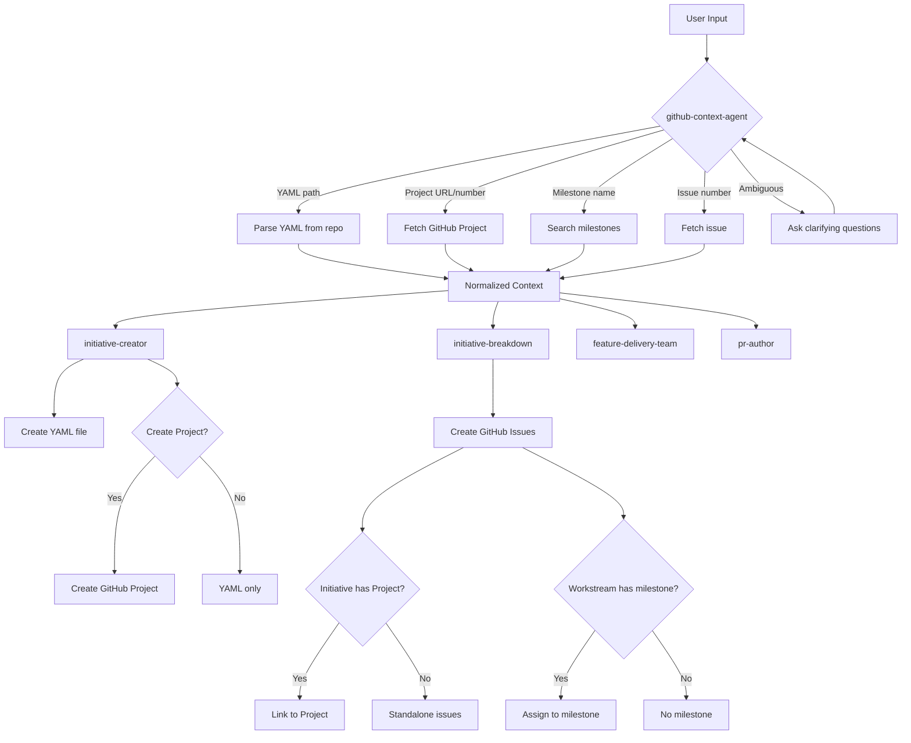

# GitHub Initiatives Integration Design

**Date:** 2026-04-13  
**Status:** Draft  
**Owner:** claude-grimoire

## Overview

Update claude-grimoire skills, agents, and teams to properly understand and work with the `eci-global/initiatives` YAML-based initiative system. The system uses GitHub Projects for tracking, workstreams for organization, and repo milestones for grouping issues. Currently, skills incorrectly treat GitHub issues as initiatives and lack understanding of the full organizational hierarchy.

## Problem Statement

The current claude-grimoire implementation references "initiatives" but doesn't understand the actual structure used in production:

1. **Initiatives are GitHub Projects, not Issues** - YAML files define initiatives with `github_project: {org, number}` linking to GitHub Projects v2
2. **Missing workstream/milestone structure** - Initiatives contain workstreams (repos + milestones) that group related work
3. **No YAML awareness** - Skills don't know how to read or create YAML initiative files
4. **Rigid input assumptions** - Skills assume specific formats instead of flexibly detecting context
5. **Progress tracking gaps** - YAML schema includes rich progress metadata not captured by skills
6. **initiative-creator too rigid** - Assumes every invocation creates a YAML file, but most work is creating/linking individual issues to existing initiatives or projects

This creates confusion when users want to:
- Create standalone issues or link existing issues to initiatives/projects
- Work with existing GitHub Projects without creating YAML files
- Break down initiatives into tasks across multiple repos and milestones
- Link PRs to the correct initiative structure
- Track progress consistently with the YAML schema

**Key insight:** GitHub Projects typically already exist. YAML initiatives are comprehensive tracking documents created occasionally, not for every piece of work. The skill should be flexible enough to handle: standalone issues, issue linking, and full YAML initiative creation as separate workflows.

## Goals

1. **Enable context-aware workflows** - Skills detect whether user provided an initiative YAML, GitHub Project, workstream, milestone, or issue
2. **Unify context gathering** - Single agent (`github-context-agent`) that understands all organizational patterns
3. **Support flexible work creation** - `initiative-creator` can handle: standalone issues, linking to existing projects/initiatives, or creating full YAML initiatives (rare)
4. **Default to linking, not creating** - Assume projects exist and need linking; only create when explicitly needed
5. **Accept direct parameters** - Skills accept issue numbers or creation parameters to skip interactive flows
6. **Intelligent breakdown** - `initiative-breakdown` works with any input type and creates appropriately structured tasks
7. **Maintain backward compatibility** - Existing issue/PR workflows continue to work unchanged

## Success Metrics

- ✅ Skills successfully process YAML initiatives, GitHub Projects, workstreams, milestones, and standalone issues
- ✅ `github-context-agent` returns consistent context structure for any input type
- ✅ `initiative-creator` can create standalone issues, link to existing projects/initiatives, and create full YAML initiatives
- ✅ `initiative-creator` accepts issue numbers as direct input without requiring YAML creation
- ✅ `initiative-creator` accepts parameters (title, body, project, etc.) to skip interactive questions
- ✅ Created tasks link correctly to GitHub Projects when initiatives use them
- ✅ Linking to existing projects is the default (not creation)
- ✅ Existing workflows without initiatives continue to function
- ✅ Skills ask clarifying questions when input is ambiguous

## Scope

### In Scope

**github-context-agent enhancements:**
- New input types: `initiative`, `project`, `workstream`, `milestone`
- YAML file parsing from `eci-global/initiatives` repo
- GitHub Projects v2 API integration (GraphQL)
- Workstream and milestone data fetching
- Ambiguous input detection and clarification prompts
- Normalized output structure for all types

**initiative-creator skill updates:**
- Accept existing issue number as direct input
- Create standalone issues from parameters
- Link issues to existing initiatives (YAML) or projects (default: link, not create)
- Optionally create YAML files conforming to schema v2 (for comprehensive initiatives)
- Rarely create GitHub Projects (only when explicitly needed - projects typically pre-exist)
- Handle all optional fields (jira, confluence, steward, pulse, tags) for YAML creation
- Support multiple workflows: standalone issue, issue + linking, full initiative with YAML
- Commit YAML to `eci-global/initiatives` repo (when YAML workflow chosen)

**initiative-breakdown skill updates:**
- Accept flexible input (YAML path, project URL, issue #, milestone, workstream)
- Call `github-context-agent` to resolve input
- Create issues and assign to appropriate milestones
- Link issues to GitHub Project if initiative has one
- Support breaking down by workstream
- Handle standalone issues not part of initiatives

**Team updates:**
- `feature-delivery-team` - Route to appropriate workflow based on context
- `pr-autopilot-team` - Link PRs to projects correctly
- Both teams use enhanced `github-context-agent`

**Skill updates:**
- `pr-author` - Link PRs to GitHub Projects and YAML initiatives
- `visual-prd` - Reference initiative YAML structure

### Out of Scope

- Modifying existing YAML files (manual editing only)
- Real-time sync between YAML and GitHub Projects (YAML is source of truth, updated manually)
- Automatic progress tracking updates in YAML (steward handles this separately)
- JIRA/Confluence API integration (YAML stores keys/IDs only)
- Dashboard generation logic (handled by separate workflow)
- Migration of existing initiative references (one-time manual update)
- GitHub Project board customization (use GitHub UI for column/field setup)

## Technical Approach

### Architecture



### Data Structures

#### Enhanced github-context-agent Input

```json
{
  "type": "initiative | project | workstream | milestone | issue | pr",
  "identifier": "string (flexible format)",
  "depth": "shallow | standard | deep",
  "include": {
    "yaml": true,
    "project": true,
    "workstreams": true,
    "milestones": true,
    "issues": true,
    "progress": true
  }
}
```

**Identifier formats supported:**
- YAML path: `initiatives/2026-q1-ai-cost-intelligence-platform.yaml`
- GitHub Project URL: `https://github.com/orgs/eci-global/projects/14`
- GitHub Project reference: `eci-global#14`
- Issue: `owner/repo#123`
- Milestone: `owner/repo milestone "M1 - Foundation"`
- Workstream: `initiative:<yaml-name> workstream:<workstream-name>`

#### Normalized Output Structure

```json
{
  "success": true,
  "context": {
    "type": "initiative",
    "metadata": {
      "schema_version": 2,
      "name": "2026 Q1 - AI Cost Intelligence Platform",
      "description": "...",
      "status": "active",
      "phase": "operational-go-live",
      "owner": "tedgar",
      "team": ["tedgar"],
      "tags": ["finops", "ai-governance"]
    },
    "github_project": {
      "org": "eci-global",
      "number": 14,
      "url": "https://github.com/orgs/eci-global/projects/14",
      "title": "2026 Q1 - AI Cost Intelligence Platform",
      "state": "OPEN",
      "items_count": 76
    },
    "workstreams": [
      {
        "name": "S3 Unified FOCUS Data Lake",
        "repo": "eci-global/one-cloud-cloud-costs",
        "milestones": [
          {
            "title": "M0 — S3 Unified FOCUS Data Lake (DataSync)",
            "number": 5,
            "due": "2026-03-31",
            "status": "deployed",
            "state": "closed",
            "open_issues": 0,
            "closed_issues": 12
          }
        ]
      }
    ],
    "progress": {
      "github_issues": "76/76",
      "jira_epics": "6/6",
      "jira_stories": "65/65",
      "tests": "471/471",
      "infrastructure": "deployed"
    },
    "jira": {
      "project_key": "ITPLAT01",
      "parent_key": "ITPMO01-1540",
      "board_url": "https://eci-solutions.atlassian.net/...",
      "epics": [...]
    },
    "confluence": {
      "space_key": "CGIP",
      "page_id": "1960706070",
      "page_url": "https://confluence.../pages/1960706070"
    },
    "yaml_path": "initiatives/2026-q1-ai-cost-intelligence-platform.yaml"
  }
}
```

### Component Changes

#### 1. github-context-agent

**New capabilities:**
- Detect input type from identifier format
- Fetch YAML files from `eci-global/initiatives` repo using `gh api`
- Parse YAML with schema v2 support
- Query GitHub Projects v2 API via GraphQL
- Fetch milestone data for workstreams
- Ask clarifying questions when input is ambiguous

**Implementation notes:**
- Use `gh api` to fetch YAML content: `gh api repos/eci-global/initiatives/contents/initiatives/<file>.yaml`
- Use GraphQL for Projects v2: `gh api graphql -f query='...'`
- Cache YAML and project data for 5 minutes (existing pattern)
- Return error with suggestions if multiple matches found

**Error handling:**
- Ambiguous input → Ask user to clarify (e.g., "Did you mean the initiative YAML or GitHub Project #14?")
- YAML not found → List available initiatives, suggest creation
- Project not found → Suggest using YAML path if available
- Invalid schema → Report validation errors clearly

#### 2. initiative-creator

**Updated workflow:**

**Phase 1: Detect input and determine mode**
```
Check what user provided:
- Issue number (e.g., #123, owner/repo#123) → Use existing issue
- Issue creation parameters (title, description) → Create new issue
- YAML path or initiative reference → Link to existing initiative
- GitHub Project reference → Link to existing project
- Nothing specific → Ask what to create

If existing issue provided:
  Fetch issue via github-context-agent
  Ask: "Should I link this to an initiative or project?"
  
If issue parameters provided:
  Create issue first
  Ask: "Should I link this to an initiative or project?"
  
If nothing provided:
  Ask user: "What would you like to create?"
  A) Standalone issue (just create issue)
  B) Issue linked to existing initiative/project (provide reference)
  C) New initiative with YAML (full initiative creation)
```

**Phase 2: Handle linking (if applicable)**
```
If user wants to link to existing:
  Ask: "What should I link to?"
  - YAML initiative path
  - GitHub Project (org#number or URL)
  - Workstream within initiative
  - Milestone within repo
  
  Invoke github-context-agent to fetch context
  Link issue appropriately:
    - Add to GitHub Project if project exists
    - Assign to milestone if specified
    - Add comment referencing initiative YAML
```

**Phase 3: Full initiative creation (only if user chose option C)**
- Gather initiative details via interview (existing questions)
- Ask about GitHub Project:
  - "Does a GitHub Project already exist for this?" (default: yes, just link)
    - If yes: "What's the project number or URL?"
    - If no: "Should I create one?" (rare case)
- Ask about optional integrations:
  - JIRA tracking (project_key, parent_key, epics)
  - Confluence documentation (space_key, page_id)
  - Tags for categorization
  - Steward monitoring

**Phase 4: Create and link as appropriate**
```
Based on mode:

Standalone issue:
  1. Create issue via `gh issue create`
  2. Done

Issue with linking:
  1. Create/fetch issue
  2. If project provided: Link to project
  3. If milestone provided: Assign to milestone
  4. If initiative provided: Add comment with YAML reference
  
Full initiative:
  1. Generate schema v2 YAML file
  2. Validate against schema
  3. If linking existing project: Add github_project section to YAML
  4. If creating new project (rare): Create via `gh project create`, add to YAML
  5. Commit YAML to `eci-global/initiatives` repo
  6. If issues to create: Create and link them
```

**Phase 5: Next steps prompt**
```
"Created [issue/initiative]! What's next?"
- For standalone issue: "Issue created at [URL]"
- For linked issue: "Issue created and linked to [project/initiative]"
- For new initiative: "Initiative created! Would you like me to break it down into tasks?"
  If yes: Invoke /initiative-breakdown
  If no: Provide summary and next steps
```

**YAML File Generation (Critical):**

When creating YAML files, the skill MUST follow the exact structure used in `eci-global/initiatives`:

```yaml
# Required fields (always include)
schema_version: 2
name: "Initiative Name"
description: >-
  Multi-line description using YAML folded scalar (>-).
  Second line continues naturally.
status: active  # One of: active, planning, paused, completed, cancelled
owner: github-username
team:
  - member1
  - member2

# Optional but recommended
phase: "current-phase-name"  # Only if applicable

github_project:  # Only if project exists or being created
  org: eci-global
  number: 14

workstreams:  # Only if repos and milestones are defined
  - name: "Workstream Name"
    repo: org/repo-name
    milestones:
      - title: "M1 — Milestone Title"
        number: 5
        due: "2026-03-31"  # ISO 8601 date
        status: deployed

# Optional integrations (only include if data provided)
jira:
  project_key: PROJKEY
  parent_key: PROJ-123
  board_url: https://...
  epics:
    - key: PROJ-456
      milestone: "Milestone Title"
      status: Done

confluence:
  space_key: SPACE
  page_id: "123456789"
  page_version: 3

steward:
  enabled: true
  last_run: "2026-03-26T22:30:00Z"  # ISO 8601 timestamp

tags:
  - tag1
  - tag2

pulse:
  scan_window: 24h
  channels:
    - teams
    - slack
  discussion_category: "Category Name"
```

**YAML Generation Rules:**
1. **Only include sections with actual data** - Don't include empty optional sections
2. **Use `>-` for descriptions** - Folded scalar for multi-line text
3. **ISO 8601 dates** - Format: `YYYY-MM-DD` for dates, `YYYY-MM-DDTHH:MM:SSZ` for timestamps
4. **Validate status enum** - Must be one of: active, planning, paused, completed, cancelled
5. **Quote strings with special chars** - Milestone titles with "—" or ":", JIRA keys, etc.
6. **Match field names exactly** - `github_project` not `githubProject`, `page_id` not `pageId`
7. **Array formatting** - Use YAML list syntax with hyphens
8. **No trailing commas** - YAML doesn't use commas like JSON

**File naming convention:**
- Use kebab-case: `2026-q1-initiative-name.yaml`
- Include quarter/year prefix if time-bound
- Be descriptive but concise (under 60 chars)

**Implementation notes:**
- Default assumption: Projects already exist, just need linking (not creation)
- YAML creation is for comprehensive initiatives, not every issue
- Parse examples from eci-global/initiatives repo to understand current patterns
- Validate generated YAML against schema before committing
- Can be invoked with parameters to skip interactive questions:
  - `--issue owner/repo#123` (use existing)
  - `--title "..." --body "..."` (create new)
  - `--project org#14` (link to project)
  - `--initiative path/to/yaml` (link to initiative)
  - `--yaml` (force YAML creation)

#### 3. initiative-breakdown

**Updated workflow:**

**Phase 1: Context detection**
```
Accept input in any format:
- YAML file path
- GitHub Project URL or org#number
- Workstream identifier
- Milestone name
- Issue number (for adding context)

Invoke github-context-agent with input
```

**Phase 2: Validate breakdown scope**
```
Agent returns context type:
- Initiative → Break into workstreams/milestones/issues
- Project → Fetch project items, organize into logical groups
- Workstream → Break into milestone-scoped issues
- Milestone → Create issues for this milestone
- Issue → Suggest adding to initiative or creating related tasks

If scope is unclear or too large, ask user to clarify
```

**Phase 3: Task generation** (enhanced existing logic)
- Generate tasks as before (categories, dependencies, estimates)
- When creating issues:
  - If initiative has GitHub Project → Link issue to project
  - If workstream has milestone → Assign issue to milestone
  - If standalone → Just create issue

**Phase 4: Linking**
```
For each created issue:
1. Create via `gh issue create`
2. If github_project exists:
   - Link to project: `gh project item-add <project-number> --url <issue-url>`
3. If milestone specified:
   - Assign: `gh issue edit <number> --milestone "<milestone>"`
4. Add comment linking to initiative YAML (if applicable)
```

#### 4. feature-delivery-team

**Phase 1 enhancement:**
```
Current:
"Is there an existing GitHub initiative/issue for this feature?"

Updated:
"What's the scope for this feature?"
A) Part of an existing initiative (provide YAML/project/workstream)
B) New initiative (create YAML + optional project)
C) Standalone task (no initiative)

Use github-context-agent to resolve input
Proceed with appropriate workflow based on type
```

**Phase 3 enhancement:**
- If breaking down initiative: Pass full context to initiative-breakdown
- If breaking down project: Fetch project items and organize
- If standalone: Create simple task list

**Phase 7 enhancement (PR creation):**
- If task linked to initiative: Reference YAML file in PR description
- If task linked to project: Add project link
- pr-author handles GitHub references

#### 5. pr-author

**Enhanced context gathering:**
```
Current: Fetch related issues
Updated: Fetch related issues AND check for initiative/project links

In PR description:
- "Part of initiative: [name] (path/to/yaml)"
- "Project: [GitHub Project #14]"
- "Workstream: [workstream-name]"
- "Closes #123"
```

**Implementation:**
- Check issue for project links via GraphQL
- Check issue comments for initiative references
- Include in "Related Work" section

### GitHub API Integration

**YAML operations:**
```bash
# Read YAML
gh api repos/eci-global/initiatives/contents/initiatives/<file>.yaml \
  --jq '.content' | base64 -d

# List initiatives
gh api repos/eci-global/initiatives/contents/initiatives --jq '.[].name'

# Create/update YAML (via git operations)
git clone https://github.com/eci-global/initiatives.git
# ... edit file ...
git add initiatives/<file>.yaml
git commit -m "Add initiative: <name>"
git push origin main
```

**GitHub Projects v2 (GraphQL):**
```graphql
# Fetch project
query {
  organization(login: "eci-global") {
    projectV2(number: 14) {
      title
      url
      items(first: 100) {
        nodes {
          content {
            ... on Issue {
              number
              title
              state
            }
          }
        }
      }
    }
  }
}

# Create project
mutation {
  createProjectV2(input: {
    ownerId: "<org-id>"
    title: "Initiative Name"
  }) {
    projectV2 {
      id
      number
    }
  }
}

# Add issue to project
mutation {
  addProjectV2ItemById(input: {
    projectId: "<project-id>"
    contentId: "<issue-id>"
  }) {
    item {
      id
    }
  }
}
```

**Milestones:**
```bash
# List milestones
gh api repos/<owner>/<repo>/milestones

# Assign issue to milestone
gh issue edit <number> --repo <owner>/<repo> --milestone "<title>"
```

## Error Handling

### Ambiguous Input
```
User: "Break down project 14"
Agent: "I found multiple matches:
  A) GitHub Project eci-global#14
  B) Initiative YAML: 2026-q1-ai-cost-intelligence-platform.yaml (uses project 14)
  
Which did you mean?"
```

### Missing Initiative
```
User: "Create tasks for the auth initiative"
Agent: "I couldn't find an initiative matching 'auth'. 

Available initiatives:
- 2026-q1-ai-cost-intelligence-platform.yaml
- 2026-q1-coralogix-quota-manager.yaml
- ...

Would you like to:
A) Create a new initiative for auth
B) Search again with different keywords
C) Work with standalone issues instead"
```

### Invalid YAML Schema
```
Error: YAML validation failed
- Missing required field: status
- Invalid status value: 'in progress' (must be one of: active, planning, paused, completed, cancelled)
- workstreams[0].milestones[1] missing 'title' field

Please fix these issues before committing.
```

### GitHub Project Not Found
```
Warning: Initiative YAML references github_project.number: 99, but project not found in org.

Options:
A) Create the GitHub Project now
B) Update YAML to remove project reference
C) Correct the project number
```

## Configuration

### Project-level config (.claude-grimoire/config.json)

```json
{
  "github": {
    "initiativesRepo": "eci-global/initiatives",
    "initiativesPath": "initiatives/",
    "defaultOrg": "eci-global"
  },
  "initiatives": {
    "schemaVersion": 2,
    "autoCreateProject": false,
    "requireJiraLink": false,
    "requireConfluenceLink": false,
    "defaultStatus": "planning",
    "enableSteward": true,
    "defaultTags": []
  },
  "initiativeCreator": {
    "templatePath": ".claude-grimoire/templates/initiative.yaml",
    "defaultMode": "issue",
    "assumeProjectExists": true,
    "promptForOptionalFields": true,
    "allowParameters": true
  },
  "initiativeBreakdown": {
    "linkToProject": true,
    "assignToMilestones": true,
    "createMilestonesIfMissing": false
  }
}
```

**Configuration notes:**
- `defaultMode: "issue"` - Start by assuming user wants to create/link an issue, not a full YAML initiative
- `assumeProjectExists: true` - Default assumption is projects already exist and need linking (not creation)
- `allowParameters: true` - Accept command-line style parameters to skip interactive questions
- Projects are rarely created - only when explicitly requested and needed

### YAML Template (matches eci-global/initiatives structure)

File: `.claude-grimoire/templates/initiative.yaml`

**This template matches the actual schema v2 structure used in the eci-global/initiatives repo:**

```yaml
schema_version: 2
name: ""  # Required: Human-readable initiative name
description: >-  # Required: One or two sentences describing what this delivers
  
status: planning  # Required: One of: active, planning, paused, completed, cancelled
phase: ""  # Optional: Current phase (e.g., "operational-go-live", "implementation")
owner: ""  # Required: GitHub username of initiative owner
team:  # Optional: List of GitHub usernames on the team
  - ""

github_project:  # Optional: GitHub Project v2 integration
  org: ""  # Organization name (e.g., "eci-global")
  number: 0  # Project number
  id: ""  # Optional: Project node ID for GraphQL

progress:  # Optional: Progress tracking metrics
  github_issues: ""  # e.g., "76/76"
  jira_epics: ""  # e.g., "6/6"
  jira_stories: ""  # e.g., "65/65"
  tests: ""  # e.g., "471/471"
  infrastructure: ""  # e.g., "deployed", "in-progress"
  last_reconciled: ""  # ISO 8601 date (e.g., "2026-03-23")

workstreams:  # Optional: Logical groupings of work across repos
  - name: ""  # Workstream name
    repo: ""  # Full repo path (e.g., "eci-global/repo-name")
    milestones:  # Milestones within this workstream
      - title: ""  # Milestone title (as it appears in GitHub)
        number: 0  # Milestone number in the repo
        due: ""  # ISO 8601 date (e.g., "2026-03-31")
        status: ""  # e.g., "deployed", "code-complete", "in-progress"

jira:  # Optional: JIRA tracking integration
  project_key: ""  # JIRA project key (e.g., "ITPLAT01")
  parent_key: ""  # Parent epic/initiative key (e.g., "ITPMO01-1540")
  board_url: ""  # Optional: JIRA board URL
  epics:  # Optional: List of JIRA epics
    - key: ""  # Epic key (e.g., "ITPLAT01-1987")
      milestone: ""  # Optional: Which workstream milestone this maps to
      status: ""  # Epic status (e.g., "Done", "In Progress")

confluence:  # Optional: Confluence documentation
  space_key: ""  # Confluence space key
  page_id: ""  # Confluence page ID (numeric string)
  page_version: 0  # Optional: Page version number

steward:  # Optional: Steward monitoring integration
  enabled: true  # Whether steward monitoring is enabled
  last_run: ""  # Optional: ISO 8601 timestamp of last steward run

tags:  # Optional: Tags for categorization and filtering
  - ""

pulse:  # Optional: Pulse communication settings
  scan_window: ""  # e.g., "24h"
  channels:  # Communication channels
    - ""
  discussion_category: ""  # Category for discussions
```

**Field notes based on actual eci-global/initiatives examples:**
- Use `>-` for multi-line descriptions (YAML folded scalar)
- Dates should be ISO 8601 format: `YYYY-MM-DD` for dates, `YYYY-MM-DDTHH:MM:SSZ` for timestamps
- `status` values must be one of the enum: `active`, `planning`, `paused`, `completed`, `cancelled`
- `workstreams[].milestones[].status` is freeform (e.g., "deployed", "code-complete", "in-progress")
- `progress` section tracks various metrics - fields are initiative-specific
- All optional sections can be omitted entirely if not needed
- Template shows structure; skills should only include sections that have actual data

## Migration Strategy

### Phase 1: Extend github-context-agent
1. Add new input type detection
2. Implement YAML parsing
3. Add GitHub Projects v2 API calls
4. Add workstream/milestone fetching
5. Return normalized context
6. **Testing:** Verify all input types resolve correctly

### Phase 2: Update initiative-creator
1. Add "creation mode" selection (issue/linking/YAML creation)
2. Add parameter parsing for direct invocation
3. Implement YAML generation following eci-global/initiatives structure:
   - Fetch example YAMLs from repo for reference
   - Use exact field names and structure from schema v2
   - Implement validation against actual repo examples
   - Only include sections with data (no empty optionals)
4. Add GitHub Project creation option (rare case)
5. Add optional field gathering (JIRA, Confluence, steward, pulse, tags)
6. Implement YAML commit workflow to eci-global/initiatives
7. **Testing:** Create initiatives with various combinations, validate YAML structure matches repo examples

### Phase 3: Update initiative-breakdown
1. Add flexible input handling
2. Call github-context-agent for context resolution
3. Update task generation to use workstreams/milestones
4. Implement GitHub Project linking
5. Implement milestone assignment
6. **Testing:** Break down initiatives, projects, workstreams, milestones

### Phase 4: Update teams and skills
1. Update feature-delivery-team Phase 1
2. Update pr-autopilot-team context gathering
3. Update pr-author to include initiative/project links
4. Update visual-prd to reference initiative structure
5. **Testing:** End-to-end workflows with initiatives

### Phase 5: Documentation
1. Update skill documentation
2. Add initiative workflows to examples
3. Document YAML schema and fields
4. Create troubleshooting guide

### Phase 6: Backward Compatibility Verification
1. Test existing workflows without initiatives
2. Verify issue-only workflows still work
3. Test PR creation without initiative context
4. Validate no breaking changes to teams

## Testing Strategy

### Unit Tests
- YAML parsing (valid, invalid, missing fields)
- Input type detection (all formats)
- GitHub API calls (mocked)
- Context normalization

### Integration Tests
- End-to-end initiative creation
- Initiative breakdown with project linking
- Milestone assignment
- PR linking to initiatives
- Team orchestration with initiatives

### Test Cases

**Test Case 1: Create initiative with GitHub Project**
```
Input: User wants new initiative with project
Expected: YAML created, project created, linked
Verify: YAML exists, project exists, github_project.number populated
```

**Test Case 2: Break down initiative by workstream**
```
Input: YAML path + workstream name
Expected: Issues created, assigned to workstream milestones, linked to project
Verify: Issues exist, milestone assigned, project link exists
```

**Test Case 3: Ambiguous input resolution**
```
Input: "project 14" (could be GitHub Project or initiative referencing it)
Expected: Agent asks clarifying question
Verify: User prompted to choose A or B
```

**Test Case 4: Standalone issue workflow**
```
Input: Create task without initiative
Expected: Issue created, no project/milestone links
Verify: Issue exists, no initiative references
```

**Test Case 5: PR linking to initiative**
```
Input: Create PR for task linked to initiative
Expected: PR description includes initiative reference
Verify: PR contains "Part of initiative: <name>"
```

**Test Case 6: YAML structure validation**
```
Input: Create full YAML initiative with all optional sections
Expected: Generated YAML matches eci-global/initiatives structure exactly
Verify:
  - schema_version: 2
  - description uses >- folded scalar
  - Dates are ISO 8601 format
  - workstreams.milestones has title, number, due, status
  - jira.epics has key, milestone, status
  - Only includes sections with data (no empty optionals)
  - Field names match exactly (snake_case)
  - YAML parses without errors
  - Structure matches examples from eci-global/initiatives repo
```

**Test Case 7: Issue creation with parameter passing**
```
Input: /initiative-creator --title "Fix auth bug" --project eci-global#14
Expected: Issue created and linked to project without interactive prompts
Verify: Issue exists, linked to project #14, no YAML created
```

**Test Case 8: Link existing issue to initiative**
```
Input: /initiative-creator --issue eci-global/repo#123 --initiative path/to/yaml
Expected: Existing issue linked to initiative
Verify: Issue comment added referencing YAML, no new issue created
```

## Dependencies

### External
- GitHub CLI (`gh`) with authentication
- Git access to `eci-global/initiatives` repo
- GitHub API permissions:
  - `repo` (read/write issues, projects)
  - `project` (read/write projects v2)
  - `read:org` (read organization data)

### Internal
- Existing github-context-agent agent
- Existing initiative-creator skill
- Existing initiative-breakdown skill
- Existing feature-delivery-team team
- Existing pr-author skill

### Optional
- JIRA API (for validation, not required)
- Confluence API (for validation, not required)

## Risks and Mitigations

### Risk 1: YAML Schema Changes
**Risk:** Schema v2 might evolve, breaking parsing logic  
**Mitigation:** Version detection in parser, error messages for unsupported versions, schema validation before commit

### Risk 2: GitHub Projects v2 API Changes
**Risk:** GraphQL schema changes could break queries  
**Mitigation:** Use `gh api` which abstracts API versions, add error handling for missing fields

### Risk 3: Ambiguous Input Too Frequent
**Risk:** Users frustrated by constant clarification prompts  
**Mitigation:** Smart defaults (prefer YAML over project if both exist), remember user preferences, provide examples

### Risk 4: YAML Conflicts
**Risk:** Multiple agents editing YAML simultaneously  
**Mitigation:** YAML is append-only for creation, agent never modifies existing YAML (manual only), clear documentation

### Risk 5: Performance
**Risk:** Fetching full initiative context is slow  
**Mitigation:** Use existing 5-minute cache, offer depth levels (shallow/standard/deep), parallel API calls where possible

## Future Enhancements

- **Automatic progress updates**: Steward-like functionality to update YAML progress fields based on GitHub state
- **YAML validation tool**: CLI tool to validate YAML against schema before commit
- **Initiative templates**: Pre-defined templates for common initiative patterns
- **Multi-initiative views**: Skills that work across multiple initiatives
- **JIRA/Confluence sync**: Two-way sync between YAML and external systems
- **Initiative metrics**: Dashboards and reports from YAML data
- **Workstream dependencies**: Track dependencies between workstreams across initiatives

## Open Questions

None - all clarifying questions answered during brainstorming.

## Success Criteria Checklist

Implementation is complete when:
- ✅ github-context-agent handles all input types (initiative, project, workstream, milestone, issue)
- ✅ initiative-creator generates valid schema v2 YAML files
- ✅ initiative-creator optionally creates GitHub Projects
- ✅ initiative-breakdown accepts flexible input and calls github-context-agent
- ✅ Created issues link to GitHub Projects when applicable
- ✅ Created issues assigned to milestones when applicable
- ✅ feature-delivery-team routes based on context type
- ✅ pr-author includes initiative/project references
- ✅ Ambiguous input triggers clarifying questions
- ✅ All test cases pass
- ✅ Existing workflows without initiatives continue to work
- ✅ Documentation updated

---

Generated with 🤖 [claude-grimoire](https://github.com/martythewizard/claude-grimoire)
