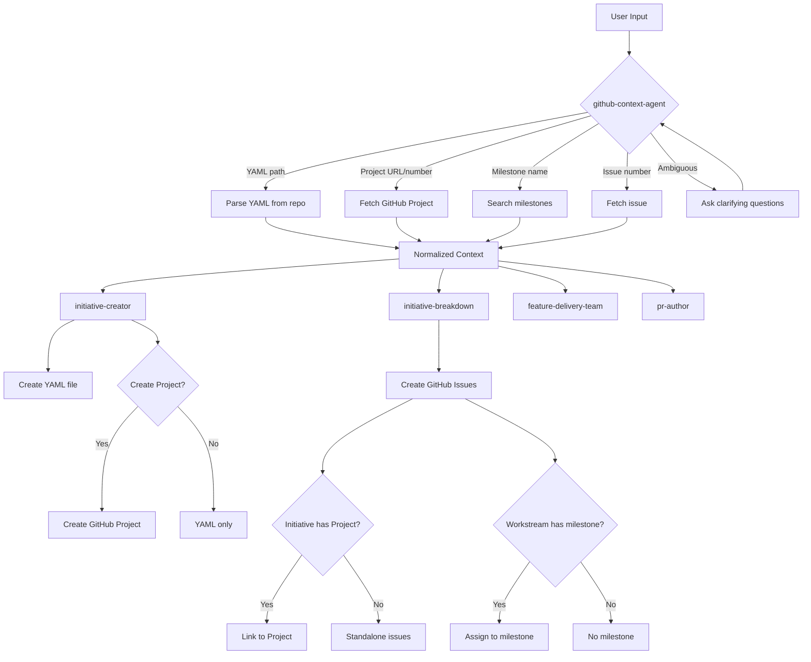

# GitHub Initiatives Integration Design

**Date:** 2026-04-13  
**Status:** Draft  
**Owner:** claude-grimoire

## Overview

Update claude-grimoire skills, agents, and teams to properly understand and work with the `eci-global/initiatives` YAML-based initiative system. The system uses GitHub Projects for tracking, workstreams for organization, and repo milestones for grouping issues. Currently, skills incorrectly treat GitHub issues as initiatives and lack understanding of the full organizational hierarchy.

## Problem Statement

The current claude-grimoire implementation references "initiatives" but doesn't understand the actual structure used in production:

1. **Initiatives are GitHub Projects, not Issues** - YAML files define initiatives with `github_project: {org, number}` linking to GitHub Projects v2
2. **Missing workstream/milestone structure** - Initiatives contain workstreams (repos + milestones) that group related work
3. **No YAML awareness** - Skills don't know how to read or create YAML initiative files
4. **Rigid input assumptions** - Skills assume specific formats instead of flexibly detecting context
5. **Progress tracking gaps** - YAML schema includes rich progress metadata not captured by skills

This creates confusion when users want to:
- Create initiatives that map to their actual system
- Break down initiatives into tasks across multiple repos and milestones
- Link PRs to the correct initiative structure
- Track progress consistently with the YAML schema

## Goals

1. **Enable context-aware workflows** - Skills detect whether user provided an initiative YAML, GitHub Project, workstream, milestone, or issue
2. **Unify context gathering** - Single agent (`github-context-agent`) that understands all organizational patterns
3. **Support flexible creation** - `initiative-creator` can create YAML files, optionally create GitHub Projects, and handle all linking
4. **Intelligent breakdown** - `initiative-breakdown` works with any input type and creates appropriately structured tasks
5. **Maintain backward compatibility** - Existing issue/PR workflows continue to work unchanged

## Success Metrics

- ✅ Skills successfully process YAML initiatives, GitHub Projects, workstreams, milestones, and standalone issues
- ✅ `github-context-agent` returns consistent context structure for any input type
- ✅ `initiative-creator` generates valid schema v2 YAML files
- ✅ Created tasks link correctly to GitHub Projects when initiatives use them
- ✅ Existing workflows without initiatives continue to function
- ✅ Skills ask clarifying questions when input is ambiguous

## Scope

### In Scope

**github-context-agent enhancements:**
- New input types: `initiative`, `project`, `workstream`, `milestone`
- YAML file parsing from `eci-global/initiatives` repo
- GitHub Projects v2 API integration (GraphQL)
- Workstream and milestone data fetching
- Ambiguous input detection and clarification prompts
- Normalized output structure for all types

**initiative-creator skill updates:**
- Create YAML files conforming to schema v2
- Optional GitHub Project creation (ask user)
- Handle all optional fields (jira, confluence, steward, pulse, tags)
- Support multiple workflows: new initiative, add to existing project, standalone
- Commit YAML to `eci-global/initiatives` repo
- Link issues to project if project exists

**initiative-breakdown skill updates:**
- Accept flexible input (YAML path, project URL, issue #, milestone, workstream)
- Call `github-context-agent` to resolve input
- Create issues and assign to appropriate milestones
- Link issues to GitHub Project if initiative has one
- Support breaking down by workstream
- Handle standalone issues not part of initiatives

**Team updates:**
- `feature-delivery-team` - Route to appropriate workflow based on context
- `pr-autopilot-team` - Link PRs to projects correctly
- Both teams use enhanced `github-context-agent`

**Skill updates:**
- `pr-author` - Link PRs to GitHub Projects and YAML initiatives
- `visual-prd` - Reference initiative YAML structure

### Out of Scope

- Modifying existing YAML files (manual editing only)
- Real-time sync between YAML and GitHub Projects (YAML is source of truth, updated manually)
- Automatic progress tracking updates in YAML (steward handles this separately)
- JIRA/Confluence API integration (YAML stores keys/IDs only)
- Dashboard generation logic (handled by separate workflow)
- Migration of existing initiative references (one-time manual update)
- GitHub Project board customization (use GitHub UI for column/field setup)

## Technical Approach

### Architecture



### Data Structures

#### Enhanced github-context-agent Input

```json
{
  "type": "initiative | project | workstream | milestone | issue | pr",
  "identifier": "string (flexible format)",
  "depth": "shallow | standard | deep",
  "include": {
    "yaml": true,
    "project": true,
    "workstreams": true,
    "milestones": true,
    "issues": true,
    "progress": true
  }
}
```

**Identifier formats supported:**
- YAML path: `initiatives/2026-q1-ai-cost-intelligence-platform.yaml`
- GitHub Project URL: `https://github.com/orgs/eci-global/projects/14`
- GitHub Project reference: `eci-global#14`
- Issue: `owner/repo#123`
- Milestone: `owner/repo milestone "M1 - Foundation"`
- Workstream: `initiative:<yaml-name> workstream:<workstream-name>`

#### Normalized Output Structure

```json
{
  "success": true,
  "context": {
    "type": "initiative",
    "metadata": {
      "schema_version": 2,
      "name": "2026 Q1 - AI Cost Intelligence Platform",
      "description": "...",
      "status": "active",
      "phase": "operational-go-live",
      "owner": "tedgar",
      "team": ["tedgar"],
      "tags": ["finops", "ai-governance"]
    },
    "github_project": {
      "org": "eci-global",
      "number": 14,
      "url": "https://github.com/orgs/eci-global/projects/14",
      "title": "2026 Q1 - AI Cost Intelligence Platform",
      "state": "OPEN",
      "items_count": 76
    },
    "workstreams": [
      {
        "name": "S3 Unified FOCUS Data Lake",
        "repo": "eci-global/one-cloud-cloud-costs",
        "milestones": [
          {
            "title": "M0 — S3 Unified FOCUS Data Lake (DataSync)",
            "number": 5,
            "due": "2026-03-31",
            "status": "deployed",
            "state": "closed",
            "open_issues": 0,
            "closed_issues": 12
          }
        ]
      }
    ],
    "progress": {
      "github_issues": "76/76",
      "jira_epics": "6/6",
      "jira_stories": "65/65",
      "tests": "471/471",
      "infrastructure": "deployed"
    },
    "jira": {
      "project_key": "ITPLAT01",
      "parent_key": "ITPMO01-1540",
      "board_url": "https://eci-solutions.atlassian.net/...",
      "epics": [...]
    },
    "confluence": {
      "space_key": "CGIP",
      "page_id": "1960706070",
      "page_url": "https://confluence.../pages/1960706070"
    },
    "yaml_path": "initiatives/2026-q1-ai-cost-intelligence-platform.yaml"
  }
}
```

### Component Changes

#### 1. github-context-agent

**New capabilities:**
- Detect input type from identifier format
- Fetch YAML files from `eci-global/initiatives` repo using `gh api`
- Parse YAML with schema v2 support
- Query GitHub Projects v2 API via GraphQL
- Fetch milestone data for workstreams
- Ask clarifying questions when input is ambiguous

**Implementation notes:**
- Use `gh api` to fetch YAML content: `gh api repos/eci-global/initiatives/contents/initiatives/<file>.yaml`
- Use GraphQL for Projects v2: `gh api graphql -f query='...'`
- Cache YAML and project data for 5 minutes (existing pattern)
- Return error with suggestions if multiple matches found

**Error handling:**
- Ambiguous input → Ask user to clarify (e.g., "Did you mean the initiative YAML or GitHub Project #14?")
- YAML not found → List available initiatives, suggest creation
- Project not found → Suggest using YAML path if available
- Invalid schema → Report validation errors clearly

#### 2. initiative-creator

**Updated workflow:**

**Phase 1: Determine creation mode**
```
Ask user: "What would you like to create?"
A) New initiative (YAML + optional GitHub Project)
B) Add tasks to existing initiative
C) Standalone issues (no initiative)

If A: Continue with initiative creation
If B: Fetch existing initiative context via github-context-agent
If C: Skip to issue creation
```

**Phase 2: Gather initiative details** (existing interview, enhanced)
- All existing questions remain
- Add: "Should I create a GitHub Project for this initiative?"
  - If yes: Collect project details
  - If no: YAML only

**Phase 3: Gather optional integrations**
```
Ask (one at a time):
- "Is this tracked in JIRA?" → If yes, collect project_key, parent_key, epics
- "Is there Confluence documentation?" → If yes, collect space_key, page_id
- "What tags apply?" → Collect tags array
- "Should we enable Steward monitoring?" → Enable steward section
```

**Phase 4: Generate and create**
1. Generate schema v2 YAML file
2. Validate against schema
3. If GitHub Project requested:
   - Create project via `gh project create`
   - Add org and number to YAML
4. Commit YAML to `eci-global/initiatives` repo
5. Create initial workstreams (if repos known)

**Phase 5: Breakdown prompt**
```
"Initiative created! Would you like me to break it down into tasks now?"
If yes: Invoke /initiative-breakdown
If no: Provide next steps
```

**File operations:**
- Clone or fetch `eci-global/initiatives` repo
- Write YAML to `initiatives/<name>.yaml`
- Commit with message: "Add initiative: <name>"
- Push to main branch

#### 3. initiative-breakdown

**Updated workflow:**

**Phase 1: Context detection**
```
Accept input in any format:
- YAML file path
- GitHub Project URL or org#number
- Workstream identifier
- Milestone name
- Issue number (for adding context)

Invoke github-context-agent with input
```

**Phase 2: Validate breakdown scope**
```
Agent returns context type:
- Initiative → Break into workstreams/milestones/issues
- Project → Fetch project items, organize into logical groups
- Workstream → Break into milestone-scoped issues
- Milestone → Create issues for this milestone
- Issue → Suggest adding to initiative or creating related tasks

If scope is unclear or too large, ask user to clarify
```

**Phase 3: Task generation** (enhanced existing logic)
- Generate tasks as before (categories, dependencies, estimates)
- When creating issues:
  - If initiative has GitHub Project → Link issue to project
  - If workstream has milestone → Assign issue to milestone
  - If standalone → Just create issue

**Phase 4: Linking**
```
For each created issue:
1. Create via `gh issue create`
2. If github_project exists:
   - Link to project: `gh project item-add <project-number> --url <issue-url>`
3. If milestone specified:
   - Assign: `gh issue edit <number> --milestone "<milestone>"`
4. Add comment linking to initiative YAML (if applicable)
```

#### 4. feature-delivery-team

**Phase 1 enhancement:**
```
Current:
"Is there an existing GitHub initiative/issue for this feature?"

Updated:
"What's the scope for this feature?"
A) Part of an existing initiative (provide YAML/project/workstream)
B) New initiative (create YAML + optional project)
C) Standalone task (no initiative)

Use github-context-agent to resolve input
Proceed with appropriate workflow based on type
```

**Phase 3 enhancement:**
- If breaking down initiative: Pass full context to initiative-breakdown
- If breaking down project: Fetch project items and organize
- If standalone: Create simple task list

**Phase 7 enhancement (PR creation):**
- If task linked to initiative: Reference YAML file in PR description
- If task linked to project: Add project link
- pr-author handles GitHub references

#### 5. pr-author

**Enhanced context gathering:**
```
Current: Fetch related issues
Updated: Fetch related issues AND check for initiative/project links

In PR description:
- "Part of initiative: [name] (path/to/yaml)"
- "Project: [GitHub Project #14]"
- "Workstream: [workstream-name]"
- "Closes #123"
```

**Implementation:**
- Check issue for project links via GraphQL
- Check issue comments for initiative references
- Include in "Related Work" section

### GitHub API Integration

**YAML operations:**
```bash
# Read YAML
gh api repos/eci-global/initiatives/contents/initiatives/<file>.yaml \
  --jq '.content' | base64 -d

# List initiatives
gh api repos/eci-global/initiatives/contents/initiatives --jq '.[].name'

# Create/update YAML (via git operations)
git clone https://github.com/eci-global/initiatives.git
# ... edit file ...
git add initiatives/<file>.yaml
git commit -m "Add initiative: <name>"
git push origin main
```

**GitHub Projects v2 (GraphQL):**
```graphql
# Fetch project
query {
  organization(login: "eci-global") {
    projectV2(number: 14) {
      title
      url
      items(first: 100) {
        nodes {
          content {
            ... on Issue {
              number
              title
              state
            }
          }
        }
      }
    }
  }
}

# Create project
mutation {
  createProjectV2(input: {
    ownerId: "<org-id>"
    title: "Initiative Name"
  }) {
    projectV2 {
      id
      number
    }
  }
}

# Add issue to project
mutation {
  addProjectV2ItemById(input: {
    projectId: "<project-id>"
    contentId: "<issue-id>"
  }) {
    item {
      id
    }
  }
}
```

**Milestones:**
```bash
# List milestones
gh api repos/<owner>/<repo>/milestones

# Assign issue to milestone
gh issue edit <number> --repo <owner>/<repo> --milestone "<title>"
```

## Error Handling

### Ambiguous Input
```
User: "Break down project 14"
Agent: "I found multiple matches:
  A) GitHub Project eci-global#14
  B) Initiative YAML: 2026-q1-ai-cost-intelligence-platform.yaml (uses project 14)
  
Which did you mean?"
```

### Missing Initiative
```
User: "Create tasks for the auth initiative"
Agent: "I couldn't find an initiative matching 'auth'. 

Available initiatives:
- 2026-q1-ai-cost-intelligence-platform.yaml
- 2026-q1-coralogix-quota-manager.yaml
- ...

Would you like to:
A) Create a new initiative for auth
B) Search again with different keywords
C) Work with standalone issues instead"
```

### Invalid YAML Schema
```
Error: YAML validation failed
- Missing required field: status
- Invalid status value: 'in progress' (must be one of: active, planning, paused, completed, cancelled)
- workstreams[0].milestones[1] missing 'title' field

Please fix these issues before committing.
```

### GitHub Project Not Found
```
Warning: Initiative YAML references github_project.number: 99, but project not found in org.

Options:
A) Create the GitHub Project now
B) Update YAML to remove project reference
C) Correct the project number
```

## Configuration

### Project-level config (.claude-grimoire/config.json)

```json
{
  "github": {
    "initiativesRepo": "eci-global/initiatives",
    "initiativesPath": "initiatives/",
    "defaultOrg": "eci-global"
  },
  "initiatives": {
    "schemaVersion": 2,
    "autoCreateProject": false,
    "requireJiraLink": false,
    "requireConfluenceLink": false,
    "defaultStatus": "planning",
    "enableSteward": true,
    "defaultTags": []
  },
  "initiativeCreator": {
    "templatePath": ".claude-grimoire/templates/initiative.yaml",
    "alwaysCreateProject": false,
    "promptForOptionalFields": true
  },
  "initiativeBreakdown": {
    "linkToProject": true,
    "assignToMilestones": true,
    "createMilestonesIfMissing": false
  }
}
```

### YAML Template (optional)

File: `.claude-grimoire/templates/initiative.yaml`
```yaml
schema_version: 2
name: ""
description: ""
status: planning
owner: ""
team: []

github_project:
  org: ""
  number: 0

workstreams: []

jira:
  project_key: ""
  parent_key: ""
  epics: []

confluence:
  space_key: ""
  page_id: ""

steward:
  enabled: true

tags: []
```

## Migration Strategy

### Phase 1: Extend github-context-agent
1. Add new input type detection
2. Implement YAML parsing
3. Add GitHub Projects v2 API calls
4. Add workstream/milestone fetching
5. Return normalized context
6. **Testing:** Verify all input types resolve correctly

### Phase 2: Update initiative-creator
1. Add "creation mode" selection
2. Implement YAML generation (schema v2)
3. Add GitHub Project creation option
4. Add optional field gathering (JIRA, Confluence, etc.)
5. Implement YAML commit workflow
6. **Testing:** Create initiatives with various combinations of options

### Phase 3: Update initiative-breakdown
1. Add flexible input handling
2. Call github-context-agent for context resolution
3. Update task generation to use workstreams/milestones
4. Implement GitHub Project linking
5. Implement milestone assignment
6. **Testing:** Break down initiatives, projects, workstreams, milestones

### Phase 4: Update teams and skills
1. Update feature-delivery-team Phase 1
2. Update pr-autopilot-team context gathering
3. Update pr-author to include initiative/project links
4. Update visual-prd to reference initiative structure
5. **Testing:** End-to-end workflows with initiatives

### Phase 5: Documentation
1. Update skill documentation
2. Add initiative workflows to examples
3. Document YAML schema and fields
4. Create troubleshooting guide

### Phase 6: Backward Compatibility Verification
1. Test existing workflows without initiatives
2. Verify issue-only workflows still work
3. Test PR creation without initiative context
4. Validate no breaking changes to teams

## Testing Strategy

### Unit Tests
- YAML parsing (valid, invalid, missing fields)
- Input type detection (all formats)
- GitHub API calls (mocked)
- Context normalization

### Integration Tests
- End-to-end initiative creation
- Initiative breakdown with project linking
- Milestone assignment
- PR linking to initiatives
- Team orchestration with initiatives

### Test Cases

**Test Case 1: Create initiative with GitHub Project**
```
Input: User wants new initiative with project
Expected: YAML created, project created, linked
Verify: YAML exists, project exists, github_project.number populated
```

**Test Case 2: Break down initiative by workstream**
```
Input: YAML path + workstream name
Expected: Issues created, assigned to workstream milestones, linked to project
Verify: Issues exist, milestone assigned, project link exists
```

**Test Case 3: Ambiguous input resolution**
```
Input: "project 14" (could be GitHub Project or initiative referencing it)
Expected: Agent asks clarifying question
Verify: User prompted to choose A or B
```

**Test Case 4: Standalone issue workflow**
```
Input: Create task without initiative
Expected: Issue created, no project/milestone links
Verify: Issue exists, no initiative references
```

**Test Case 5: PR linking to initiative**
```
Input: Create PR for task linked to initiative
Expected: PR description includes initiative reference
Verify: PR contains "Part of initiative: <name>"
```

## Dependencies

### External
- GitHub CLI (`gh`) with authentication
- Git access to `eci-global/initiatives` repo
- GitHub API permissions:
  - `repo` (read/write issues, projects)
  - `project` (read/write projects v2)
  - `read:org` (read organization data)

### Internal
- Existing github-context-agent agent
- Existing initiative-creator skill
- Existing initiative-breakdown skill
- Existing feature-delivery-team team
- Existing pr-author skill

### Optional
- JIRA API (for validation, not required)
- Confluence API (for validation, not required)

## Risks and Mitigations

### Risk 1: YAML Schema Changes
**Risk:** Schema v2 might evolve, breaking parsing logic  
**Mitigation:** Version detection in parser, error messages for unsupported versions, schema validation before commit

### Risk 2: GitHub Projects v2 API Changes
**Risk:** GraphQL schema changes could break queries  
**Mitigation:** Use `gh api` which abstracts API versions, add error handling for missing fields

### Risk 3: Ambiguous Input Too Frequent
**Risk:** Users frustrated by constant clarification prompts  
**Mitigation:** Smart defaults (prefer YAML over project if both exist), remember user preferences, provide examples

### Risk 4: YAML Conflicts
**Risk:** Multiple agents editing YAML simultaneously  
**Mitigation:** YAML is append-only for creation, agent never modifies existing YAML (manual only), clear documentation

### Risk 5: Performance
**Risk:** Fetching full initiative context is slow  
**Mitigation:** Use existing 5-minute cache, offer depth levels (shallow/standard/deep), parallel API calls where possible

## Future Enhancements

- **Automatic progress updates**: Steward-like functionality to update YAML progress fields based on GitHub state
- **YAML validation tool**: CLI tool to validate YAML against schema before commit
- **Initiative templates**: Pre-defined templates for common initiative patterns
- **Multi-initiative views**: Skills that work across multiple initiatives
- **JIRA/Confluence sync**: Two-way sync between YAML and external systems
- **Initiative metrics**: Dashboards and reports from YAML data
- **Workstream dependencies**: Track dependencies between workstreams across initiatives

## Open Questions

None - all clarifying questions answered during brainstorming.

## Success Criteria Checklist

Implementation is complete when:
- ✅ github-context-agent handles all input types (initiative, project, workstream, milestone, issue)
- ✅ initiative-creator generates valid schema v2 YAML files
- ✅ initiative-creator optionally creates GitHub Projects
- ✅ initiative-breakdown accepts flexible input and calls github-context-agent
- ✅ Created issues link to GitHub Projects when applicable
- ✅ Created issues assigned to milestones when applicable
- ✅ feature-delivery-team routes based on context type
- ✅ pr-author includes initiative/project references
- ✅ Ambiguous input triggers clarifying questions
- ✅ All test cases pass
- ✅ Existing workflows without initiatives continue to work
- ✅ Documentation updated

---

Generated with 🤖 [claude-grimoire](https://github.com/martythewizard/claude-grimoire)
