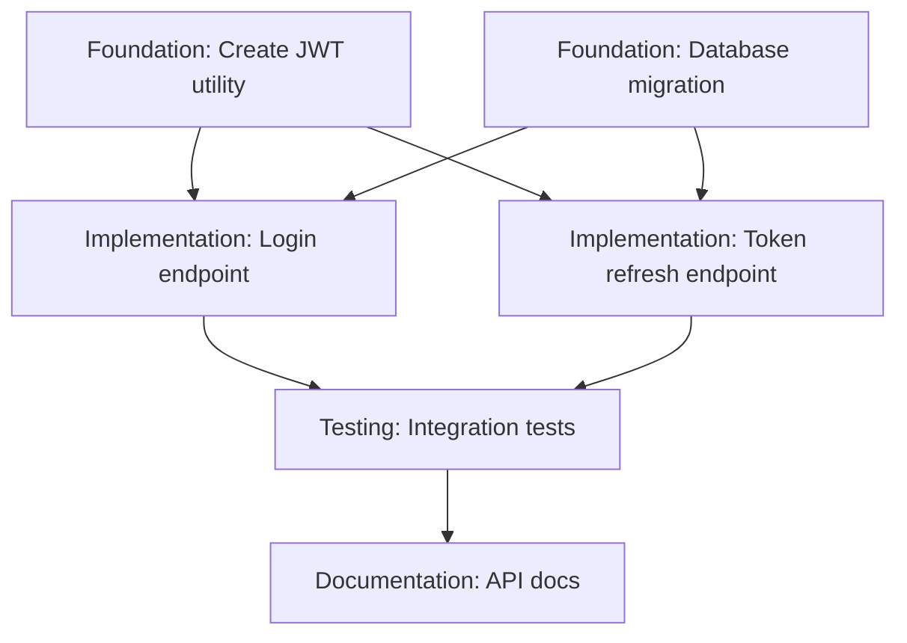

# Initiative Breakdown

Transforms GitHub initiatives into actionable, ordered tasks with clear acceptance criteria, dependencies, and effort estimates. Analyzes current codebase state and creates GitHub issues linked to the parent initiative.

## Purpose

Convert high-level initiatives into concrete implementation tasks:
- Ordered tasks with explicit dependencies
- Clear acceptance criteria per task
- Effort estimates (S/M/L sizing)
- GitHub issues linked to parent initiative
- Implementation guidance and file references
- Architecture design for complex initiatives

## When to Use

- After creating an initiative with `/initiative-creator`
- When an initiative scope is defined but lacks task breakdown
- Need to estimate effort and plan sprints
- Coordinating work across team members
- Creating a roadmap from a high-level goal

## Workflow

### 1. Fetch Initiative Context

Use the `github-context-agent` to gather full initiative details:

**Required information:**
- Initiative title and description
- Goals and success metrics
- Scope definition (in/out of scope)
- Dependencies and constraints
- Timeline and milestones
- Related issues and PRs

**Invoke agent:**
```
github-context-agent({
  "type": "initiative",
  "identifier": "owner/repo#123",
  "depth": "deep"
})
```

**Validate initiative is ready for breakdown:**
- ✅ Goals clearly defined
- ✅ Scope boundaries established
- ✅ Success criteria specified
- ✅ Technical approach outlined

**If initiative is incomplete:**
> "This initiative is missing [goals/scope/success criteria]. I recommend using `/initiative-creator` to refine it before breaking it down. Should we do that first?"

### 2. Analyze Current Codebase

Understand existing architecture and patterns:

**What to check:**
- Current directory structure and organization
- Existing similar features or patterns to reuse
- Relevant configuration files
- Test infrastructure and patterns
- Documentation structure

**Read key files:**
- `CLAUDE.md` - Project conventions and patterns
- `README.md` - Architecture overview
- Recent commits related to the initiative
- Existing tests showing patterns

**Identify reusable components:**
- Existing utilities or helpers
- Common patterns (authentication, validation, etc.)
- Shared UI components or styles
- Database migration patterns

### 3. Determine Complexity

Assess whether architectural design is needed:

**Indicators of high complexity:**
- New abstraction layers required
- Multiple services/repositories affected
- Significant data model changes
- New third-party integrations
- Performance or scalability concerns

**If complex (2+ indicators above):**
> "This initiative involves [complexity factors]. Should I invoke the system-architect-agent to design abstraction layers and create architecture diagrams before breaking down tasks? This will ensure a solid technical foundation."
>
> Options:
> - A) Yes, get architectural design first
> - B) I already have the architecture planned
> - C) Skip architecture, this is straightforward

**If they choose A:** Invoke `system-architect-agent` with initiative context

### 4. Identify Task Categories

Break work into logical groupings:

**Common categories:**
- **Foundation**: Core abstractions, data models, infrastructure
- **Implementation**: Feature development, business logic
- **Integration**: Connect with external services or systems
- **Testing**: Test infrastructure, test cases, validation
- **Documentation**: README updates, API docs, examples
- **Migration**: Data migrations, schema changes, deprecations
- **Deployment**: Configuration, monitoring, rollout plans

**Order categories by dependency:**
1. Foundation must come first
2. Implementation builds on foundation
3. Integration and testing in parallel
4. Documentation and deployment near the end

### 5. Generate Task List

Create specific, actionable tasks within each category:

**Task naming convention:**
```
[Category] Action specific thing
```

**Examples:**
- ✅ `[Foundation] Create JWT token generation utility`
- ✅ `[Implementation] Add login endpoint with JWT validation`
- ✅ `[Testing] Add integration tests for authentication flow`
- ❌ `Add authentication` (too vague)
- ❌ `Update code` (not specific)

**Each task should include:**

```markdown
## [Task Title]

**Description:**
[1-2 sentences explaining what needs to be done]

**Acceptance Criteria:**
- [ ] Specific requirement 1
- [ ] Specific requirement 2
- [ ] Specific requirement 3
- [ ] Tests written and passing
- [ ] Documentation updated

**Implementation Notes:**
- Use existing `utils/auth.go` pattern for token generation
- Add new endpoint in `api/handlers/auth.go`
- Follow error handling pattern from `api/handlers/users.go`
- Migration required: Add `auth_tokens` table

**Files to Modify:**
- `utils/auth.go` - Add token generation
- `api/handlers/auth.go` - New login endpoint
- `database/migrations/` - Add migration file
- `api/handlers/auth_test.go` - Add tests

**Dependencies:**
- Depends on: #456 (JWT library integration)
- Blocks: #789 (User profile access)

**Effort Estimate:** M (3-5 days)

**Priority:** High
```

**Effort sizing:**
- **S (Small)**: 1-2 days, well-defined, low risk
- **M (Medium)**: 3-5 days, moderate complexity, some unknowns
- **L (Large)**: 5+ days, complex, significant unknowns
  - If task is L, consider breaking it down further

**Priority levels:**
- **Critical**: Blocks other work, must be done first
- **High**: Core functionality, needed soon
- **Medium**: Important but not urgent
- **Low**: Nice-to-have, can be deferred

### 6. Map Dependencies

Create dependency graph showing task order:

**Dependency types:**
- **Blocks**: This task must complete before another can start
- **Depends on**: This task cannot start until another completes
- **Related**: Tasks can proceed in parallel but share context

**Visualize with mermaid:**


**Validate dependency chain:**
- No circular dependencies
- Foundation tasks have no dependencies
- Critical path identified
- Parallelizable work clearly marked

### 7. Review and Refine

Present the task breakdown to the user:

> "Here's the task breakdown I've generated for this initiative:
>
> **Summary:**
> - Total tasks: [N]
> - Categories: [List]
> - Estimated effort: [X-Y weeks]
> - Critical path: [Task 1 → Task 2 → Task 3]
>
> **Tasks by category:**
> [Show tasks grouped by category with estimates]
>
> Does this breakdown make sense? Should I adjust the granularity or dependencies?"

**Be ready to adjust:**
- Break large tasks into smaller chunks
- Merge tasks that are too granular
- Reorder based on feedback
- Add missing edge cases or requirements
- Adjust effort estimates

### 8. Create GitHub Issues

Once user approves, create issues for each task:

**For each task:**
```bash
gh issue create \
  --title "[Task Title]" \
  --body "$(cat task-description.md)" \
  --label "task" \
  --label "[category-label]" \
  --label "[priority-label]" \
  --assignee [assignee] \
  --milestone "[milestone]"
```

**Standard labels:**
- `task` (all tasks from breakdown)
- Category labels: `foundation`, `implementation`, `testing`, `documentation`
- Priority labels: `priority:critical`, `priority:high`, `priority:medium`, `priority:low`
- Effort labels: `effort:S`, `effort:M`, `effort:L`

**Link to parent initiative:**
```bash
gh issue comment [task-number] --body "Part of #[initiative-number]"
```

**Link dependencies:**
```bash
# If task 125 depends on task 123
gh issue comment 125 --body "Depends on #123"

# If task 123 blocks task 125
gh issue comment 123 --body "Blocks #125"
```

### 9. Create Summary Issue Comment

Add a summary comment to the parent initiative:

```markdown
## 📋 Task Breakdown

This initiative has been broken down into [N] tasks:

### Foundation (Est: [X days])
- [ ] #124 - Create JWT token generation utility (M)
- [ ] #126 - Add database migration for auth_tokens (S)

### Implementation (Est: [Y days])
- [ ] #127 - Add login endpoint (M)
- [ ] #128 - Add token refresh endpoint (S)
- [ ] #129 - Add logout endpoint (S)

### Testing (Est: [Z days])
- [ ] #130 - Integration tests for auth flow (M)
- [ ] #131 - Unit tests for JWT utilities (S)

### Documentation (Est: [W days])
- [ ] #132 - Update API documentation (S)
- [ ] #133 - Add authentication guide (M)

**Total Estimated Effort:** [Total] days ([X-Y weeks])

**Critical Path:** #124 → #126 → #127 → #130

**Architecture Design:** [Link to visual PRD or architecture document if created]

---
Generated with 🤖 [claude-grimoire](https://github.com/martythewizard/claude-grimoire)
```

### 10. Report Completion

Provide user with summary and next steps:

**Example:**
> ✅ **Initiative broken down successfully!**
>
> **Created 8 tasks** for initiative #123:
> - 2 Foundation tasks (must be done first)
> - 3 Implementation tasks
> - 2 Testing tasks
> - 1 Documentation task
>
> **Estimated effort:** 15-20 days (3-4 weeks)
>
> **Critical path:** #124 → #126 → #127 → #130 (10 days)
>
> **Tasks that can be parallelized:**
> - #128, #129 can start after #127
> - #131 can start after #124
> - #132, #133 can start anytime
>
> **Architecture:** [Link] (created by system-architect-agent)
>
> **What's next?**
> 1. Review tasks and adjust estimates if needed
> 2. Assign tasks to team members
> 3. Start with foundation tasks (#124, #126)
> 4. Use `feature-delivery-team` for implementation workflow

## Configuration

The skill respects configuration from `.claude-grimoire/config.json`:

```json
{
  "initiativeBreakdown": {
    "defaultTaskSize": "M",
    "includeFileReferences": true,
    "includeImplementationNotes": true,
    "autoInvokeArchitect": false,
    "effortEstimationUnit": "days"
  },
  "github": {
    "defaultLabels": ["task"],
    "defaultAssignee": "@me"
  }
}
```

## Tips for Effective Breakdowns

**Right-size tasks:**
- ✅ Tasks should be completable in 1-5 days
- ✅ Each task should be independently testable
- ✅ Task should have clear "done" criteria
- ❌ Avoid tasks that are too large (>5 days)
- ❌ Avoid tasks that are too small (<1 hour)

**Make dependencies explicit:**
- ✅ "Depends on #123: Needs JWT utility"
- ✅ "Blocks #125: Login endpoint needed first"
- ❌ Circular dependencies
- ❌ Implicit assumptions about order

**Provide context:**
- ✅ Reference existing files and patterns
- ✅ Note reusable components
- ✅ Link to relevant documentation
- ❌ Leave implementation as mystery

**Estimate honestly:**
- ✅ Include buffer for unknowns
- ✅ Account for testing and review time
- ✅ Note when estimates are uncertain
- ❌ Overly optimistic "happy path" estimates

**Consider edge cases:**
- ✅ Error handling and validation
- ✅ Migration and backwards compatibility
- ✅ Performance and scalability
- ✅ Security and compliance

## Integration with Other Skills

**Before initiative-breakdown:**
- `/initiative-creator` - Create well-structured initiative first
- Manual initiative creation - Ensure scope is well-defined

**During initiative-breakdown:**
- `github-context-agent` - Fetch initiative details (required)
- `system-architect-agent` - Design architecture for complex initiatives (optional)

**After initiative-breakdown:**
- `feature-delivery-team` - Execute task implementation with full workflow
- `staff-developer` - Implement individual tasks
- Manual assignment - Assign tasks to team members

## Examples

### Example 1: API Feature Breakdown

**Initiative:** "Add JWT-based authentication API"

**Breakdown result:**
```
Foundation (3 days):
- #124: Create JWT utility (M) - Token generation and validation
- #126: Database migration (S) - Add auth_tokens table

Implementation (5 days):
- #127: Login endpoint (M) - Accept credentials, return JWT
- #128: Token refresh endpoint (S) - Exchange refresh token
- #129: Logout endpoint (S) - Invalidate tokens

Testing (4 days):
- #130: Integration tests (M) - Full auth flow
- #131: Unit tests (S) - JWT utilities

Documentation (2 days):
- #132: API docs (S) - Update OpenAPI spec
- #133: Auth guide (M) - How to use auth endpoints

Total: 14 days (2-3 weeks)
Critical path: #124 → #126 → #127 → #130 (10 days)
```

---

### Example 2: Database Migration Breakdown

**Initiative:** "Migrate from Postgres to Aurora with zero downtime"

**Agent invocation:**
> This is a complex database migration. Invoking system-architect-agent to design the migration strategy...

**Breakdown result:**
```
Foundation (5 days):
- #200: Set up Aurora cluster (M) - Configure in dev/staging
- #201: Dual-write proxy (L) - Write to both DBs
- #202: Data replication script (M) - Historical data sync

Implementation (8 days):
- #203: Update connection pooling (M) - Support dual writes
- #204: Add monitoring dashboards (M) - Track replication lag
- #205: Create rollback procedure (S) - Document safe rollback
- #206: Data consistency validation (M) - Compare DB states

Testing (6 days):
- #207: Load testing (L) - Verify performance
- #208: Failover testing (M) - Test Aurora failover
- #209: Rollback testing (S) - Verify rollback works

Migration (3 days):
- #210: Production migration runbook (S) - Step-by-step guide
- #211: Post-migration cleanup (S) - Remove old DB after validation

Total: 22 days (4-5 weeks)
Critical path: #200 → #201 → #203 → #207 → migration
```

---

### Example 3: Frontend Feature Breakdown

**Initiative:** "Add dark mode to web app"

**Breakdown result:**
```
Foundation (2 days):
- #300: Theme system architecture (M) - CSS variables, context

Implementation (4 days):
- #301: Theme toggle component (S) - UI control
- #302: Persist theme preference (S) - LocalStorage + DB
- #303: Update all components (M) - Apply theme variables
- #304: System preference detection (S) - Respect OS setting

Testing (2 days):
- #305: Visual regression tests (M) - Screenshot comparison
- #306: Accessibility testing (S) - Ensure contrast ratios

Documentation (1 day):
- #307: Theme customization guide (S) - For developers

Total: 9 days (1.5-2 weeks)
Parallel work: #301 and #302 can start together after #300
```

## Error Handling

**If initiative not found:**
- Verify issue/initiative number is correct
- Check repository permissions
- Provide manual input option

**If initiative is too vague:**
- List specific gaps (missing goals, scope, etc.)
- Recommend refining with `/initiative-creator`
- Don't proceed with breakdown until ready

**If task creation fails:**
- Save task descriptions to local markdown files
- Provide manual creation commands
- Offer batch retry when API available

**If dependency chain is complex:**
- Create visual dependency graph
- Identify critical path clearly
- Highlight parallelizable work

## Common Pitfalls to Avoid

❌ **Tasks too large**: If any task is >5 days, break it down further

❌ **Vague acceptance criteria**: Every task needs concrete "done" definition

❌ **Missing file references**: Always note which files to modify

❌ **Ignoring existing patterns**: Check codebase for reusable components first

❌ **Circular dependencies**: Validate dependency graph has no cycles

❌ **Underestimating testing**: Include time for tests, review, and polish

❌ **Forgetting edge cases**: Consider error handling, validation, security

## Success Criteria

This skill is successful when:
- ✅ All tasks are sized appropriately (1-5 days each)
- ✅ Dependencies are clear and form a valid DAG
- ✅ Acceptance criteria are specific and testable
- ✅ Implementation guidance references actual files
- ✅ Effort estimates are realistic
- ✅ Team can start working immediately
- ✅ Progress is trackable (clear "done" definitions)