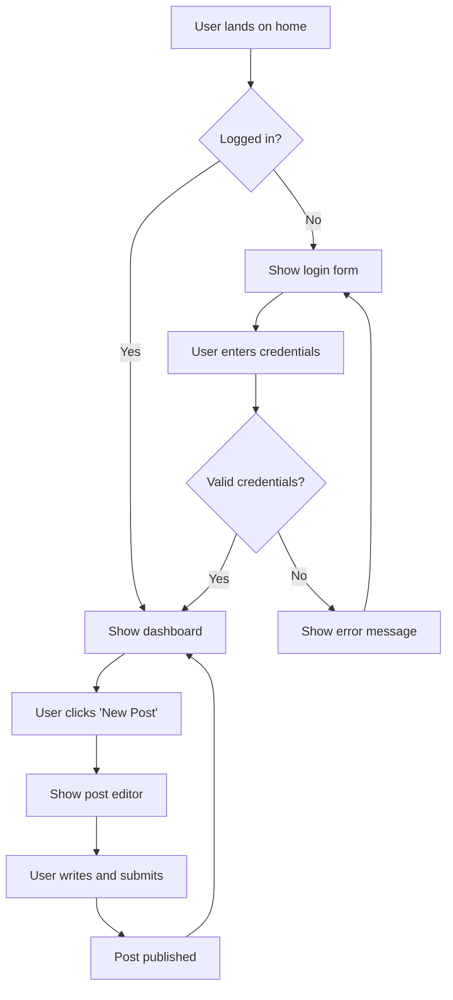
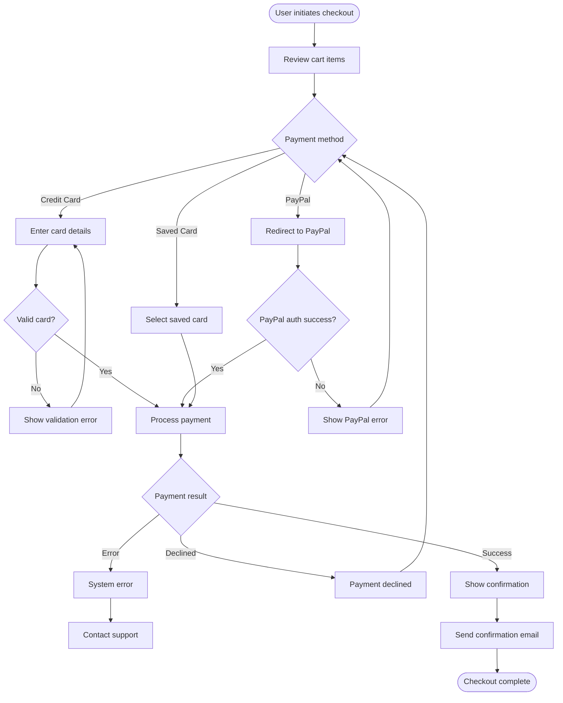
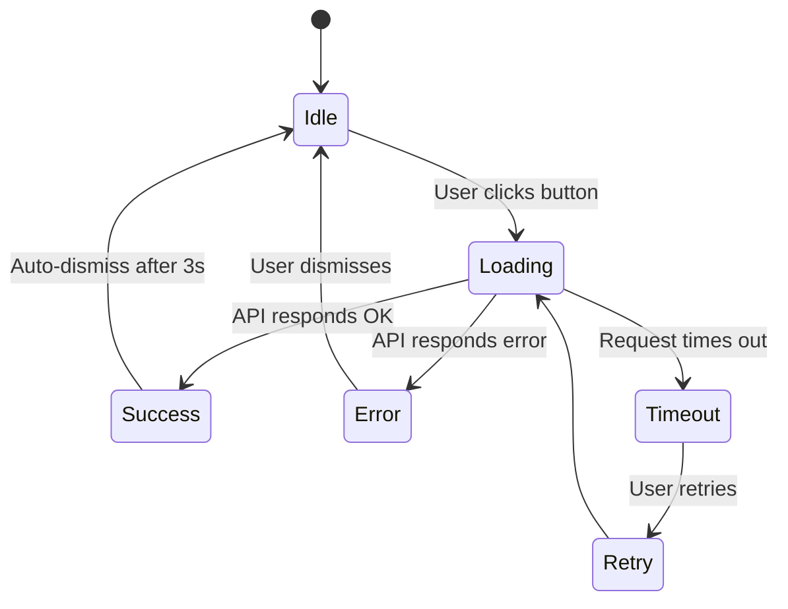
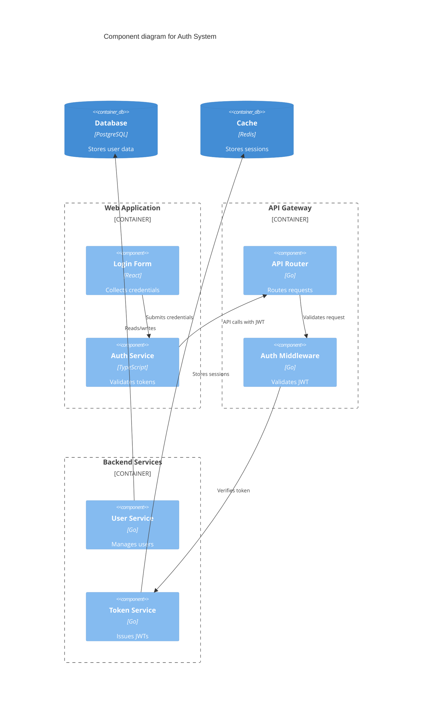
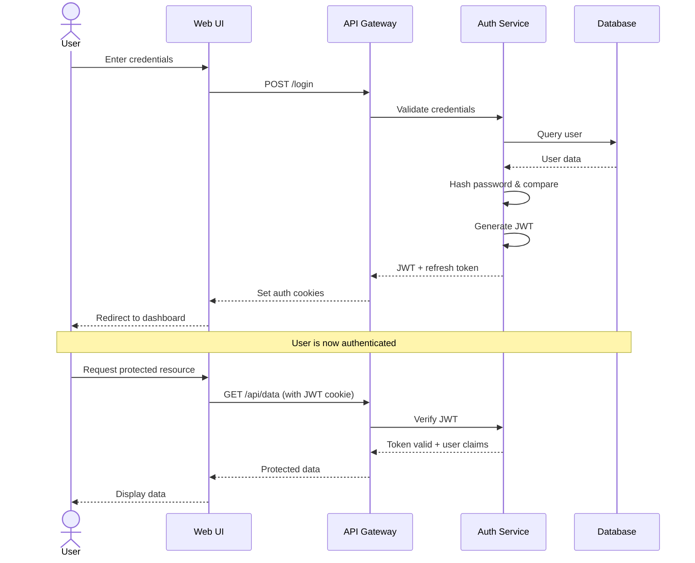
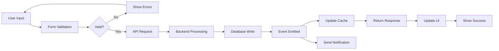

# Visual PRD

Creates interactive visual Product Requirements Documents combining UI mockups, architecture diagrams, user flows, and requirements. Ideal for complex features requiring visual planning and stakeholder alignment.

## Purpose

Transform feature ideas into comprehensive visual specifications:
- Interactive UI mockups and wireframes
- Architecture diagrams (mermaid)
- User flow visualizations
- Acceptance criteria with visual context
- Technical considerations and trade-offs
- Exportable as HTML for GitHub Pages

## When to Use

- Starting complex features with UI components
- Need to align stakeholders on design before coding
- Multiple user journeys or flows to visualize
- New architecture or abstractions required
- Visual learning preference for requirements
- Want to validate UX before implementation

## Workflow

### 1. Understand Feature Context

Interview the user about the feature:

**Initial questions (one at a time):**
- What feature are you trying to build?
- Who are the primary users of this feature?
- What problem does it solve for them?
- Are there any similar features in the product currently?
- What inspired this feature? (competitor, user feedback, etc.)

**Gather project context:**
- Review existing UI components and design patterns
- Check for related features in the codebase
- Identify existing user flows this might affect
- Review technical constraints (mobile, accessibility, performance)

### 2. Define Scope and Complexity

Determine what needs to be visualized:

**Questions to ask:**
- Does this feature have a user interface?
- How many screens or views are involved?
- Are there different user roles or permissions?
- Are there complex data relationships to show?
- Does this involve new architecture or abstractions?

**Assess visualization needs:**
- **UI mockups needed?** (Yes if user-facing interface)
- **User flows needed?** (Yes if multiple paths/states)
- **Architecture diagrams needed?** (Yes if complex data/logic)
- **Data models needed?** (Yes if new entities/relationships)
- **API diagrams needed?** (Yes if new integrations)

**Present scope options:**
> Based on your description, I can create:
> - A) Full visual PRD (UI mockups + architecture + flows)
> - B) UI-focused PRD (mockups + flows, minimal architecture)
> - C) Architecture-focused PRD (diagrams + data models, no UI mockups)
>
> Which level of detail would be most helpful?

### 3. Gather Requirements

Collect detailed requirements for visualization:

#### For UI Mockups

**Questions:**
- What's the primary action the user takes on each screen?
- What information needs to be displayed?
- Are there forms or input fields? What data do they collect?
- What happens after the user takes an action? (success/error states)
- Should this work on mobile as well as desktop?
- Any specific branding or design system to follow?

**Capture details:**
- Page/screen names and purposes
- Primary and secondary CTAs (Call To Actions)
- Data fields and their types
- Validation rules and error messages
- Loading and empty states
- Success and error feedback

#### For User Flows

**Questions:**
- What's the typical user journey through this feature?
- Are there branching paths based on conditions?
- What are the entry points to this feature?
- What are the exit points or completion states?
- Are there error or exception flows?

**Map out:**
- Step-by-step user actions
- Decision points and conditions
- System responses and feedback
- Alternative paths and edge cases

#### For Architecture

**Questions:**
- Where does the data come from? (database, API, cache)
- How is data transformed or processed?
- Are there background jobs or async operations?
- What services or external systems are involved?
- Are there performance or scalability concerns?

**Identify:**
- Data sources and sinks
- Processing steps and transformations
- Service boundaries and APIs
- Caching and performance strategies
- Error handling and resilience

### 4. Invoke System Architect (If Needed)

For complex features requiring new architecture:

**When to invoke:**
- New abstraction layers needed
- Multiple services coordinating
- Complex data flows or transformations
- Performance optimization required
- Significant architectural decisions

**Invoke agent:**
```
system-architect-agent({
  "feature": "[Feature description]",
  "requirements": "[Requirements summary]",
  "constraints": "[Technical constraints]",
  "scope": "[What needs architecting]"
})
```

**What you'll get back:**
- Abstraction layer design
- Interface definitions
- Mermaid architecture diagrams
- Implementation recommendations
- Trade-off analysis

**Integrate results:**
- Include architecture diagrams in PRD
- Reference abstraction layers in technical section
- Link trade-off analysis to decision records

### 5. Create UI Mockups with Frontend-Design

Use the frontend-design skill to build interactive mockups:

**For each screen/view:**

1. **Describe the screen:**
   > "Create a [screen name] with [key elements]. It should show [data] and allow users to [action]. Use [design system] styling."

2. **Invoke frontend-design:**
   - Provide clear description of layout and components
   - Specify interactions and states
   - Note responsive behavior if needed
   - Include sample data for realism

3. **Iterate on feedback:**
   - Show mockup to user
   - Adjust based on feedback
   - Refine interactions and styling
   - Ensure consistency across screens

**Best practices:**
- Start with the "happy path" screen first
- Then add error states and edge cases
- Use realistic sample data, not lorem ipsum
- Show loading states for async operations
- Include empty states when applicable

### 6. Create User Flow Diagrams

Visualize user journeys with mermaid:

**Simple flow example:**


**Complex flow with decision points:**


**State machine for complex interactions:**


### 7. Create Architecture Diagrams

Use mermaid to show system architecture:

**Component diagram:**


**Sequence diagram:**


**Data flow diagram:**


### 8. Write Requirements Section

Document functional and non-functional requirements:

#### Functional Requirements

**Format:**
```markdown
## Functional Requirements

### FR-1: User Authentication
**As a** user  
**I want to** log in with email and password  
**So that** I can access my personalized dashboard

**Acceptance Criteria:**
- [ ] Login form accepts email and password
- [ ] Invalid credentials show clear error message
- [ ] Successful login redirects to dashboard
- [ ] "Remember me" checkbox persists session for 30 days
- [ ] "Forgot password" link triggers reset flow

**Priority:** Critical  
**Estimate:** 5 days

### FR-2: Password Reset
**As a** user  
**I want to** reset my password if I forget it  
**So that** I can regain access to my account

**Acceptance Criteria:**
- [ ] Reset link sent to registered email
- [ ] Link expires after 24 hours
- [ ] New password must meet security requirements
- [ ] Old password is invalidated after reset
- [ ] User receives confirmation email

**Priority:** High  
**Estimate:** 3 days
```

#### Non-Functional Requirements

**Format:**
```markdown
## Non-Functional Requirements

### NFR-1: Performance
- Login request completes in <500ms (p95)
- Password reset email sent within 10 seconds
- Dashboard loads in <2 seconds on 3G connection
- System handles 1000 concurrent logins

### NFR-2: Security
- Passwords hashed with bcrypt (cost factor 12)
- JWTs signed with RS256, expire in 15 minutes
- Refresh tokens rotated on each use
- Rate limiting: 5 login attempts per minute per IP
- All auth endpoints served over HTTPS only

### NFR-3: Accessibility
- WCAG 2.1 AA compliance
- Keyboard navigation for all auth flows
- Screen reader support with ARIA labels
- Error messages announced to assistive tech
- Sufficient color contrast (4.5:1 minimum)

### NFR-4: Reliability
- 99.9% uptime SLA for auth endpoints
- Graceful degradation if cache unavailable
- Automatic retry with exponential backoff
- Database failover in <30 seconds
```

### 9. Add Technical Considerations

Document implementation details and trade-offs:

```markdown
## Technical Considerations

### Architecture Decisions

**Decision 1: JWT vs. Session Cookies**
- **Chosen:** JWT with refresh token rotation
- **Rationale:** Stateless auth scales better, enables mobile app auth
- **Trade-offs:** Cannot revoke JWTs before expiry (mitigated with short expiry + refresh tokens)
- **Alternatives considered:** Server-side sessions (simpler but harder to scale)

**Decision 2: Password Storage**
- **Chosen:** bcrypt with cost factor 12
- **Rationale:** Industry standard, resistant to brute force
- **Trade-offs:** Slower than newer algorithms like Argon2 (but proven and widely supported)
- **Migration path:** Can upgrade to Argon2 later via lazy migration

### Database Schema

```sql
CREATE TABLE users (
  id UUID PRIMARY KEY DEFAULT gen_random_uuid(),
  email VARCHAR(255) UNIQUE NOT NULL,
  password_hash VARCHAR(255) NOT NULL,
  created_at TIMESTAMP DEFAULT NOW(),
  updated_at TIMESTAMP DEFAULT NOW()
);

CREATE TABLE auth_tokens (
  id UUID PRIMARY KEY DEFAULT gen_random_uuid(),
  user_id UUID NOT NULL REFERENCES users(id) ON DELETE CASCADE,
  token_hash VARCHAR(255) NOT NULL,
  expires_at TIMESTAMP NOT NULL,
  created_at TIMESTAMP DEFAULT NOW(),
  INDEX idx_user_id (user_id),
  INDEX idx_expires_at (expires_at)
);
```

### API Endpoints

```
POST /api/auth/login
  Body: { email, password, rememberMe? }
  Response: { accessToken, refreshToken, expiresIn }

POST /api/auth/refresh
  Body: { refreshToken }
  Response: { accessToken, refreshToken, expiresIn }

POST /api/auth/logout
  Body: { refreshToken }
  Response: { success }

POST /api/auth/forgot-password
  Body: { email }
  Response: { success, message }

POST /api/auth/reset-password
  Body: { token, newPassword }
  Response: { success }
```

### Dependencies

- **New:** 
  - `jsonwebtoken` - JWT generation and validation
  - `bcrypt` - Password hashing
- **Existing:**
  - `express` - API routing
  - `pg` - Database client
  - `redis` - Session caching

### Migration Strategy

1. **Phase 1:** Implement JWT auth alongside existing session auth
2. **Phase 2:** Migrate web app to JWT (feature flag rollout)
3. **Phase 3:** Enable JWT for mobile app
4. **Phase 4:** Deprecate session auth after 90 days
5. **Phase 5:** Remove session auth code

### Rollback Plan

- Feature flag `USE_JWT_AUTH` defaults to false
- Can disable JWT auth without code deploy
- Old session auth remains functional during migration
- Database schema changes are additive only (no drops)

### Monitoring and Observability

**Metrics to track:**
- Login success/failure rate
- Token refresh rate
- Password reset request rate
- Auth endpoint latency (p50, p95, p99)
- Invalid token rate

**Alerts:**
- Auth endpoint error rate >1%
- Login latency p95 >500ms
- Failed login spike (potential brute force attack)
- Password reset email delivery failures

**Logging:**
- Log all authentication attempts (success/failure)
- Log token refresh and revocation
- Log password reset requests
- Include user_id, IP address, user agent
- Redact sensitive data (passwords, tokens)

### Security Considerations

**Threats and mitigations:**
- **Brute force:** Rate limiting (5 attempts/min/IP)
- **Token theft:** Short JWT expiry (15min) + HTTPS only
- **XSS:** HttpOnly cookies, CSP headers
- **CSRF:** SameSite cookies, CSRF tokens
- **Timing attacks:** Constant-time password comparison

**Compliance:**
- GDPR: User data export/deletion endpoints
- CCPA: Privacy policy and opt-out mechanisms
- SOC 2: Audit logging and access controls
```

### 10. Generate HTML Document

Create visual PRD as interactive HTML:

**Structure:**
```html
<!DOCTYPE html>
<html lang="en">
<head>
  <meta charset="UTF-8">
  <meta name="viewport" content="width=device-width, initial-scale=1.0">
  <title>[Feature Name] - Visual PRD</title>
  <script src="https://cdn.jsdelivr.net/npm/mermaid/dist/mermaid.min.js"></script>
  <style>
    /* Clean, professional styling */
    body { font-family: system-ui, sans-serif; max-width: 1200px; margin: 0 auto; padding: 2rem; }
    h1 { border-bottom: 3px solid #333; padding-bottom: 0.5rem; }
    h2 { margin-top: 3rem; color: #333; }
    .mockup { border: 1px solid #ddd; border-radius: 8px; padding: 1rem; margin: 1rem 0; }
    .requirement { background: #f5f5f5; padding: 1rem; margin: 0.5rem 0; border-radius: 4px; }
    .mermaid { background: white; padding: 1rem; margin: 1rem 0; }
    .toc { background: #f9f9f9; padding: 1.5rem; border-radius: 8px; margin-bottom: 2rem; }
  </style>
</head>
<body>
  <header>
    <h1>[Feature Name]</h1>
    <p class="meta">Created: [Date] | Version: 1.0 | Status: Draft</p>
  </header>

  <nav class="toc">
    <h2>Table of Contents</h2>
    <ul>
      <li><a href="#overview">Overview</a></li>
      <li><a href="#mockups">UI Mockups</a></li>
      <li><a href="#flows">User Flows</a></li>
      <li><a href="#architecture">Architecture</a></li>
      <li><a href="#requirements">Requirements</a></li>
      <li><a href="#technical">Technical Considerations</a></li>
    </ul>
  </nav>

  <section id="overview">
    <h2>Overview</h2>
    <!-- Feature description, goals, users -->
  </section>

  <section id="mockups">
    <h2>UI Mockups</h2>
    <!-- Embedded frontend-design mockups -->
  </section>

  <section id="flows">
    <h2>User Flows</h2>
    <!-- Mermaid diagrams -->
  </section>

  <section id="architecture">
    <h2>Architecture</h2>
    <!-- System architecture diagrams -->
  </section>

  <section id="requirements">
    <h2>Requirements</h2>
    <!-- Functional and non-functional requirements -->
  </section>

  <section id="technical">
    <h2>Technical Considerations</h2>
    <!-- Architecture decisions, schema, APIs, monitoring -->
  </section>

  <footer>
    <p>Generated with 🤖 <a href="https://github.com/martythewizard/claude-grimoire">claude-grimoire</a></p>
  </footer>

  <script>
    mermaid.initialize({ startOnLoad: true, theme: 'default' });
  </script>
</body>
</html>
```

**Save PRD:**
```bash
# Save to docs directory
mkdir -p docs/prds
cat > "docs/prds/$(date +%Y-%m-%d)-[feature-slug].html" <<EOF
[HTML content]
EOF

# Commit to repository
git add docs/prds/
git commit -m "Add visual PRD for [feature name]"
```

**Host on GitHub Pages (optional):**
```bash
# If GitHub Pages is enabled
git push origin main

# PRD will be available at:
# https://[username].github.io/[repo]/prds/[date]-[feature-slug].html
```

### 11. Review and Iterate

Present the visual PRD to the user:

> "I've created a visual PRD for [feature name]. It includes:
> - [N] UI mockups showing the user interface
> - User flow diagrams showing the journey
> - Architecture diagrams showing technical design
> - [M] functional requirements with acceptance criteria
> - Technical considerations including decisions, trade-offs, and migration strategy
>
> **View the PRD:** [local file path or URL]
>
> Does this accurately capture the feature requirements? Should I adjust any sections?"

**Be ready to iterate:**
- Refine mockups based on feedback
- Add missing user flows or states
- Clarify architecture decisions
- Adjust acceptance criteria
- Add more technical details

### 12. Link to Initiative (If Applicable)

If created as part of initiative planning:

```bash
# Comment on initiative with PRD link
gh issue comment [initiative-number] --body "## Visual PRD

I've created a visual PRD for this initiative:
**Local:** docs/prds/[date]-[feature-slug].html
**GitHub Pages:** [URL if available]

The PRD includes UI mockups, user flows, architecture diagrams, and detailed requirements. Please review and provide feedback before we proceed with task breakdown."
```

### 13. Report Completion

Provide summary and next steps:

**Example:**
> ✅ **Visual PRD created successfully!**
>
> **File:** `docs/prds/2026-04-13-auth-system.html`
> **Includes:**
> - 5 UI mockups (login, dashboard, reset password, etc.)
> - 3 user flow diagrams
> - 2 architecture diagrams (component + sequence)
> - 8 functional requirements with acceptance criteria
> - Non-functional requirements (performance, security, accessibility)
> - Technical considerations (decisions, schema, APIs, monitoring)
>
> **What's next?**
> 1. Review the PRD and gather stakeholder feedback
> 2. Use `/initiative-creator` to create GitHub initiative (if not done)
> 3. Use `/initiative-breakdown` to create actionable tasks
> 4. Use `feature-delivery-team` for implementation

## Configuration

The skill respects configuration from `.claude-grimoire/config.json`:

```json
{
  "visualPRD": {
    "defaultFormat": "html",
    "includeTableOfContents": true,
    "autoInvokeArchitect": false,
    "hostOnGitHubPages": false,
    "outputDirectory": "docs/prds"
  },
  "frontendDesign": {
    "designSystem": "default",
    "includeResponsive": true
  }
}
```

## Tips for Effective Visual PRDs

**Use realistic data:**
- ✅ Show actual user names, emails, dates
- ✅ Use representative content lengths
- ❌ Avoid lorem ipsum or placeholder text

**Show all states:**
- ✅ Loading, success, error states
- ✅ Empty states when no data
- ✅ Validation errors on forms
- ❌ Only showing "happy path"

**Be specific in diagrams:**
- ✅ Label all arrows and connections
- ✅ Show data types and formats
- ✅ Indicate async operations
- ❌ Vague boxes and arrows

**Include context:**
- ✅ Explain why decisions were made
- ✅ Document alternatives considered
- ✅ Note assumptions and unknowns
- ❌ Just list requirements

## Integration with Other Skills

**Before visual-prd:**
- Can be invoked standalone or by `/initiative-creator`

**During visual-prd:**
- `frontend-design` - Create UI mockups (required for UI features)
- `system-architect-agent` - Design architecture (optional, for complex features)

**After visual-prd:**
- `/initiative-breakdown` - Break PRD into tasks
- `feature-delivery-team` - Execute implementation
- Manual stakeholder review and feedback

## Success Criteria

This skill is successful when:
- ✅ Visual PRD clearly communicates the feature
- ✅ Stakeholders can understand requirements without explanation
- ✅ Developers have enough context to implement
- ✅ UI mockups are realistic and implementable
- ✅ Architecture diagrams show key technical decisions
- ✅ Requirements include acceptance criteria
- ✅ PRD can be used as source of truth during implementation